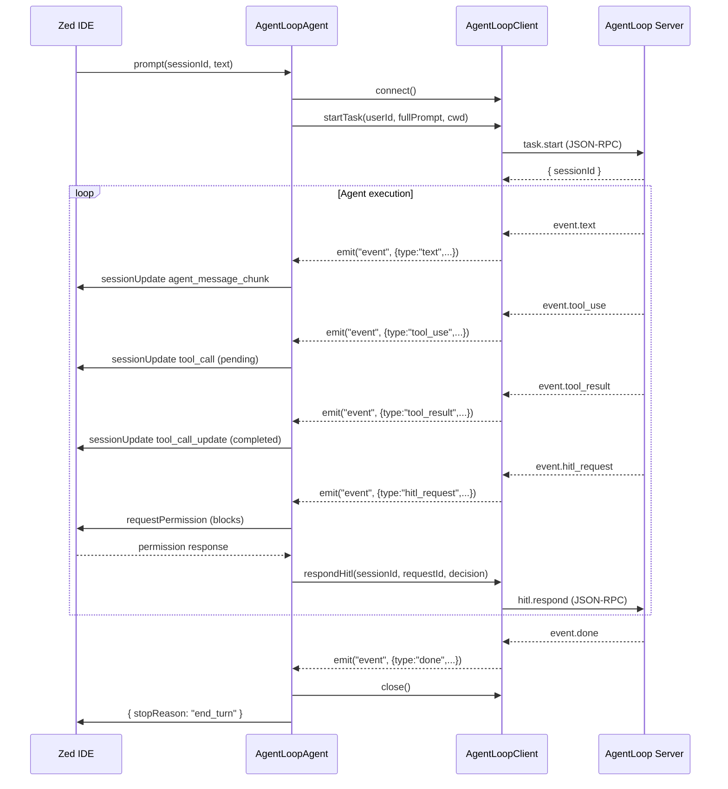

import { Aside } from '@astrojs/starlight/components';

## Event Flow Overview

`AgentLoopClient` extends Node.js `EventEmitter`. The Go server pushes newline-delimited JSON notifications over the Unix socket; the client parses each line and emits an `AgentEvent` on the `"event"` channel. `AgentLoopAgent` subscribes to this channel and translates each event into the corresponding ACP call on the Zed connection.



## AgentEvent Type

All events share the `AgentEvent` interface. The `type` field is the discriminator:

```ts
import type { AgentEvent } from "./agentloop-client.js";

client.on("event", (event: AgentEvent) => {
  switch (event.type) {
    case "text":          // event.content
    case "tool_use":      // event.toolName, event.input
    case "tool_result":   // event.toolName, event.output, event.success
    case "hitl_request":  // event.requestId, event.toolName, event.details, event.options, event.riskLevel, ...
    case "hitl_auto_approved": // event.requestId, event.toolName, event.riskLevel, event.rule
    case "done":          // event.finalOutput, event.stats
    case "error":         // event.message
    case "session_saved": // (sessionId only)
  }
});
```

All events carry `event.sessionId` — the AgentLoop server session ID.

## Event Types

### Text (`type: "text"`)

Streaming text chunks from the agent. Arrive incrementally — concatenate for the full response.

`AgentLoopAgent` forwards each chunk to Zed via `sessionUpdate` with `agent_message_chunk`:

```ts
case "text": {
  assistantResponse += event.content || "";
  await this.connection.sessionUpdate({
    sessionId,
    update: {
      sessionUpdate: "agent_message_chunk",
      content: { type: "text", text: event.content || "" },
    },
  });
}
```

### Tool Use & Result (`type: "tool_use"` / `type: "tool_result"`)

Tool invocations are displayed in Zed's tool call UI. `tool_use` opens a pending call; `tool_result` closes it with a `completed` or `failed` status.

```ts
case "tool_use": {
  const title = toolRichTitle(event.toolName!, event.input);
  const kind = toolNameToKind(event.toolName!) as acp.ToolKind;
  await this.connection.sessionUpdate({
    sessionId,
    update: {
      sessionUpdate: "tool_call",
      toolCallId: tcId,
      title,
      kind,
      status: "pending",
    },
  });
}

case "tool_result": {
  const display = extraContent ?? event.output ?? "";
  await this.connection.sessionUpdate({
    sessionId,
    update: {
      sessionUpdate: "tool_call_update",
      toolCallId: tcId,
      status: event.success ? "completed" : "failed",
      content: [{ type: "content", content: { type: "text", text: display } }],
    },
  });
}
```

For `edit` and `write` tools, `AgentLoopAgent` pre-computes a unified diff or file preview to show as the tool result content rather than the raw output string.

### HITL Request (`type: "hitl_request"`)

When the Go server requires user approval, it emits `hitl_request`. The bridge calls `connection.requestPermission()` which blocks until Zed shows the user a permission dialog and they respond.

```ts
case "hitl_request": {
  const acpOptions = (event.options || []).map((opt, i) => ({
    optionId: `opt-${i}`,
    name: opt,
    kind: classifyHitlOption(opt) as acp.PermissionOptionKind,
  }));

  const response = await this.connection.requestPermission({
    sessionId,
    toolCall: {
      toolCallId: tcId,
      toolName: event.toolName!,
      title: event.details!,
      rawInput: event.details!,
      kind: toolNameToKind(event.toolName!) as acp.ToolKind,
    },
    options: acpOptions,
  });

  const decision = hitlDecisionFromResponse(response.outcome, event.options || []);
  await client.respondHitl(event.sessionId, event.requestId!, decision);
}
```

`classifyHitlOption` maps AgentLoop option strings to ACP `PermissionOptionKind`:

| Option string contains | ACP kind |
|---|---|
| `"abort"` | `"reject_always"` |
| `"approve"` / `"allow"` / `"yes"` | `"allow_once"` |
| _(anything else)_ | `"reject_once"` |

The `hitl_request` event carries enriched optional fields from the Go security layer:

| Field | Type | Description |
|---|---|---|
| `requestId` | `string` | Unique ID to echo back in `respondHitl` |
| `toolName` | `string` | Human-readable tool label |
| `details` | `string` | Free-text description of the action |
| `options` | `string[]` | Valid response strings |
| `command` | `string?` | Raw command, path, or URL |
| `workDir` | `string?` | Working directory for the action |
| `rule` | `string?` | Policy rule that triggered the request |
| `toolCategory` | `string?` | `"file"`, `"bash"`, `"network"`, etc. |
| `filePath` | `string?` | Specific file or directory affected |
| `riskLevel` | `string?` | `"low"`, `"medium"`, or `"high"` |
| `reason` | `string?` | One-line human explanation |

### HITL Auto-Approved (`type: "hitl_auto_approved"`)

When the Go server's policy automatically approves a tool invocation, it emits `hitl_auto_approved`. The bridge shows it as a completed tool call in Zed without blocking for user input.

```ts
case "hitl_auto_approved": {
  await this.connection.sessionUpdate({
    sessionId,
    update: {
      sessionUpdate: "tool_call",
      toolCallId: tcId,
      title: `Auto-approved [${event.riskLevel}]: ${event.toolName}`,
      kind: toolNameToKind(event.toolName!) as acp.ToolKind,
      status: "completed",
    },
  });
}
```

### Done (`type: "done"`)

Signals task completion. The bridge resolves the in-flight promise, stores the assistant response in session history, persists the session to disk, and returns `{ stopReason: "end_turn" }` to Zed.

```ts
case "done": {
  // event.finalOutput — full agent output
  // event.stats.duration_ms, event.stats.tool_calls,
  //   event.stats.tokens_used, event.stats.hitl_requests
  resolve();
}
```

### Error (`type: "error"`)

Signals task failure. The bridge rejects the in-flight promise, pops the user message from history (so the failed turn isn't persisted), and lets the error surface in Zed.

```ts
case "error": {
  // Undo the user turn that triggered the failed task
  if (state.history[state.history.length - 1]?.role === "user") {
    state.history.pop();
  }
  reject(new Error(event.message || "Task error"));
}
```

### Session Saved (`type: "session_saved"`)

Informational event emitted by the server when it persists the session to its vault. The bridge does not act on this event; session history is persisted separately by the bridge itself after each `done`.

## Cancellation

Zed sends a `cancel` notification when the user stops a running task. `AgentLoopAgent.cancel()` calls `client.abortTask(alSessionId)` on the in-flight client, which sends `task.abort` to the server:

```ts
async cancel(params: acp.CancelNotification): Promise<void> {
  const state = this.sessions.get(params.sessionId);
  if (state?.agentLoopSessionId && state.activeClient) {
    await state.activeClient.abortTask(state.agentLoopSessionId);
  }
}
```

<Aside type="tip">
  `event.sessionId` in AgentEvent refers to the **AgentLoop server session ID** (`sess-xxxxxxxx`), not the ACP session ID. They are different identifiers maintained by different layers.
</Aside>
