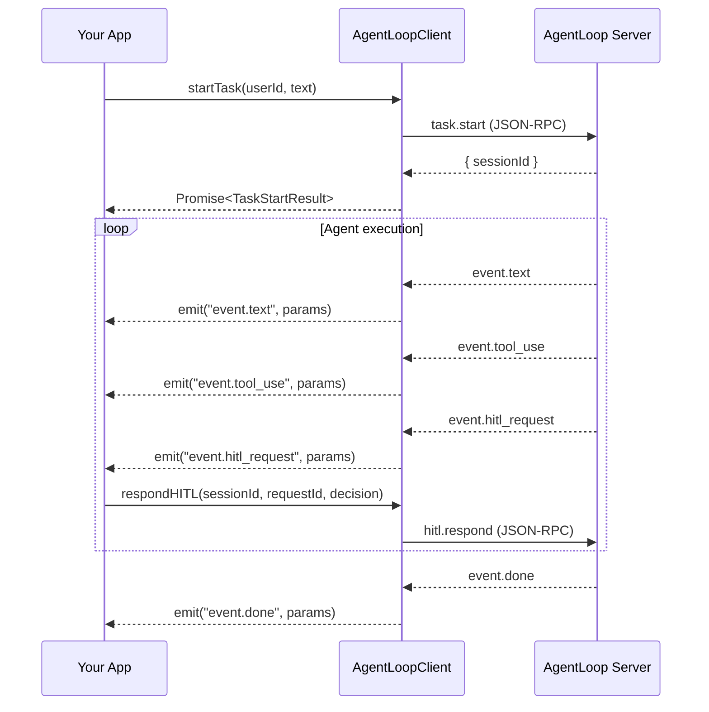

import { Aside } from '@astrojs/starlight/components';

## Event System Overview

`AgentLoopClient` extends Node.js `EventEmitter`. The server pushes newline-delimited JSON notifications; the client parses each line and re-emits it by method name. No polling required.



## Event Types

### Text (`event.text`)

Streaming text chunks from the agent. Arrives incrementally — concatenate for the full response.

```ts
import type { TextEventParams } from "./agentloop/types.js";

client.on("event.text", (params: TextEventParams) => {
  process.stdout.write(params.content);
});
```

### Tool Use (`event.tool_use` / `event.tool_result`)

```ts
import type { ToolUseEventParams, ToolResultEventParams } from "./agentloop/types.js";

client.on("event.tool_use", (params: ToolUseEventParams) => {
  console.log(`⚙  ${params.toolName}`);
});

client.on("event.tool_result", (params: ToolResultEventParams) => {
  if (!params.success) {
    console.warn(`Tool ${params.toolName} failed: ${params.output}`);
  }
});
```

### HITL Request (`event.hitl_request`)

```ts
import type { HITLRequestEventParams } from "./agentloop/types.js";

client.on("event.hitl_request", async (params: HITLRequestEventParams) => {
  console.log(`❓ ${params.toolName}: ${params.details}`);
  console.log(`   Risk: ${params.riskLevel ?? "unknown"}`);
  console.log(`   Options: ${params.options.join(" / ")}`);

  const decision = await promptUser(params.options);  // your UI
  await client.respondHITL(params.sessionId, params.requestId, decision);
});
```

`HITLRequestEventParams` has enriched optional fields populated when the Go server's security layer fires:

| Field | Type | Description |
|---|---|---|
| `toolName` | `string` | Human-readable tool label |
| `details` | `string` | Free-text description |
| `options` | `string[]` | Valid response strings |
| `command` | `string?` | Raw command / path / URL |
| `riskLevel` | `"low" \| "medium" \| "high"` | Severity hint |
| `filePath` | `string?` | Specific file or directory affected |
| `whitelistedPaths` | `string[]?` | Paths that are allowed (for context) |
| `structuredInput` | `Record<string, unknown>?` | Parsed tool input |
| `reason` | `string?` | One-line human explanation |

### Done (`event.done`)

```ts
import type { DoneEventParams } from "./agentloop/types.js";

client.on("event.done", (params: DoneEventParams) => {
  console.log(`\nCompleted: ${params.stats.toolCalls} tools, ${params.stats.duration}`);
  console.log(params.output);
});
```

### Error (`event.error`)

```ts
import type { ErrorEventParams } from "./agentloop/types.js";

client.on("event.error", (params: ErrorEventParams) => {
  console.error(`Session ${params.sessionId} failed: ${params.message}`);
});
```

## Patterns

### Single-Session Collector

Wait for a task to finish and return the full output:

```ts
async function runTask(
  client: AgentLoopClient,
  userId: string,
  text: string,
  workDir?: string,
): Promise<string> {
  const { sessionId } = await client.startTask(userId, text, workDir, "app");

  return new Promise((resolve, reject) => {
    let output = "";

    const onText = (p: TextEventParams) => {
      if (p.sessionId === sessionId) output += p.content;
    };

    const onDone = (p: DoneEventParams) => {
      if (p.sessionId !== sessionId) return;
      cleanup();
      resolve(output);
    };

    const onError = (p: ErrorEventParams) => {
      if (p.sessionId !== sessionId) return;
      cleanup();
      reject(new Error(p.message));
    };

    const cleanup = () => {
      client.off("event.text", onText);
      client.off("event.done", onDone);
      client.off("event.error", onError);
    };

    client.on("event.text", onText);
    client.on("event.done", onDone);
    client.on("event.error", onError);
  });
}
```

### Multi-Session Fan-Out

Track multiple concurrent sessions with a `Map`:

```ts
const sessions = new Map<string, { text: string }>();

client.on("event.text", (p) => {
  const s = sessions.get(p.sessionId);
  if (s) s.text += p.content;
});

client.on("event.done", (p) => {
  const s = sessions.get(p.sessionId);
  if (s) {
    console.log(`Session ${p.sessionId} done: ${s.text.slice(0, 80)}…`);
    sessions.delete(p.sessionId);
  }
});

// Start two tasks
const [a, b] = await Promise.all([
  client.startTask("marco", "task A", "/workdir-a"),
  client.startTask("marco", "task B", "/workdir-b"),
]);
sessions.set(a.sessionId, { text: "" });
sessions.set(b.sessionId, { text: "" });
```

### Auto-HITL with Allowlist

Auto-approve safe tools, prompt for anything else:

```ts
const SAFE_TOOLS = new Set(["read", "bash", "grep", "find"]);

client.on("event.hitl_request", async (p) => {
  const decision = SAFE_TOOLS.has(p.toolName) ? "approve" : await askUser(p);
  await client.respondHITL(p.sessionId, p.requestId, decision);
});
```

### Reconnect and Re-submit

Tasks in flight when the socket drops are lost on the server side. Re-submit after reconnect if needed:

```ts
client.on("reconnected", async () => {
  console.log("Reconnected — checking active sessions");
  const active = await client.listSessions("marco", "running");
  if (active.length === 0) {
    // Re-submit the task
    await client.startTask("marco", pendingTask);
  }
});
```

## All Events on One Listener

Use the `"event"` channel to receive all notifications as `RPCNotification` objects:

```ts
import type { RPCNotification } from "./agentloop/types.js";

client.on("event", (notification: RPCNotification) => {
  console.log(notification.method, notification.params);
});
```

<Aside type="tip">
  **Session filtering**: Always check `params.sessionId` before acting on an event. Multiple sessions may run concurrently, and the client receives events for all of them on the same socket.
</Aside>
