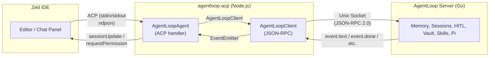

import { Aside } from '@astrojs/starlight/components';

## What Is agentloop-acp?

<Aside type="tip">
  The full source code is available on GitHub: [MarcoMruz/agentloop-acp](https://github.com/MarcoMruz/agentloop-acp)
</Aside>

`agentloop-acp` is a **TypeScript ACP bridge** that connects [Zed IDE](https://zed.dev) to the AgentLoop Go server. Zed communicates with it over the [Agent Communication Protocol (ACP)](https://github.com/agentclientprotocol) via stdin/stdout; internally it talks to the AgentLoop server over a Unix socket using JSON-RPC 2.0.

The package has two main layers:

- **`AgentLoopAgent`** — implements `acp.Agent` from `@agentclientprotocol/sdk`. Handles sessions, prompt processing, tool call display, and HITL permission dialogs in Zed.
- **`AgentLoopClient`** — thin JSON-RPC client that sends requests to the Go server and streams back events.

<Aside type="caution">
  **Scope**: `agentloop-acp` is a transport bridge only. All intelligence — memory, context, session management, HITL gating — lives in the AgentLoop Go server. The bridge just translates between ACP and the AgentLoop JSON-RPC API.
</Aside>

## Philosophy: Zero Intelligence in the Bridge

All agent logic lives in the Go server. The ACP bridge is deliberately thin and stateless:

| Bridge Owns | Bridge Does NOT Own |
|---|---|
| ACP protocol framing (ndjson stdin/stdout) | Agent logic or execution |
| Unix socket connection to Go server | Memory or context management |
| Session history persistence (crash safety) | Session lifecycle decisions |
| Tool call display formatting for Zed | HITL decision making (only relays) |
| Prompt text extraction + file link embedding | Skills or tool management |
| HITL permission dialogs in Zed | Prompt caching or context assembly |

## Protocol Compatibility

`AgentLoopClient` maps directly to the AgentLoop server's JSON-RPC 2.0 API:

| Server Method | Client Method | Purpose |
|---|---|---|
| `task.start` | `startTask()` | Begin a new agent task |
| `task.abort` | `abortTask()` | Stop the current task |
| `hitl.respond` | `respondHitl()` | Approve/deny/abort a HITL request |
| `health.check` | `healthCheck()` | Server liveness check |

## Event Streaming

The server pushes events as newline-delimited JSON notifications. `AgentLoopClient` extends `EventEmitter` and re-emits each event on the `"event"` channel with a discriminated `AgentEvent` object:

| Server Notification | `AgentEvent.type` | Key Fields |
|---|---|---|
| `event.text` | `"text"` | `content` |
| `event.tool_use` | `"tool_use"` | `toolName`, `input` |
| `event.tool_result` | `"tool_result"` | `toolName`, `output`, `success` |
| `event.hitl_request` | `"hitl_request"` | `requestId`, `toolName`, `details`, `options`, `riskLevel` |
| `event.hitl_auto_approved` | `"hitl_auto_approved"` | `requestId`, `toolName`, `riskLevel`, `rule` |
| `event.done` | `"done"` | `finalOutput`, `stats` |
| `event.error` | `"error"` | `message` |
| `event.session_saved` | `"session_saved"` | _(none beyond sessionId)_ |

## Session Persistence

`AgentLoopAgent` maintains a conversation history per ACP session and persists it to disk at `~/.local/share/agentloop/acp-sessions/<sessionId>.json` after each turn. This allows Zed to resume sessions across restarts.

## Connection Lifecycle

`AgentLoopClient` creates a **new connection per prompt** — it connects, starts a task, streams events until `event.done` or `event.error`, then closes. There is no persistent long-lived connection from the bridge to the Go server.

<Aside type="note">
  The connection-per-prompt model keeps the bridge simple and stateless. If the server restarts mid-task, the error event surfaces in Zed and the user can retry.
</Aside>
