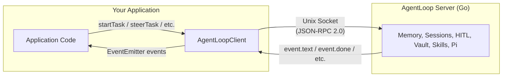

import { Aside } from '@astrojs/starlight/components';

## What Is the ACP Thin Client?

`agentloop-acp` is a **thin TypeScript client** for communicating with the AgentLoop Go server over a Unix socket using the JSON-RPC 2.0 protocol. It provides a typed, event-driven API for starting tasks, handling streaming agent events, and responding to HITL approval requests.

The client is used by the [Slack Bridge](/slack-bridge/overview/) and can be embedded in any Node.js application that needs to talk to AgentLoop.

<Aside type="caution">
  **Scope**: `agentloop-acp` is a communication library only. All intelligence — memory, context, session management, HITL gating — lives in the AgentLoop Go server. The client just sends and receives JSON-RPC messages.
</Aside>

## Philosophy: Zero Intelligence in the Client

All agent logic lives in the Go server. The client is a thin relay:



## What the Client Provides vs Doesn't

| Client Provides | Client Does NOT Provide |
|---|---|
| Unix socket connection management | Agent logic or execution |
| JSON-RPC 2.0 protocol framing | Memory or context management |
| Typed convenience methods (startTask, steerTask, etc.) | Session lifecycle decisions |
| EventEmitter-based event streaming | HITL decision making (only relays) |
| Automatic reconnection with exponential backoff | Prompt building or caching |
| Per-request timeout with rejection | Skills or tool management |

## Protocol Compatibility

The client maps directly to the AgentLoop server's JSON-RPC 2.0 API:

| Server Method | Client Method | Purpose |
|---|---|---|
| `task.start` | `startTask()` | Begin a new agent task |
| `task.steer` | `steerTask()` | Redirect a running task mid-flight |
| `task.abort` | `abortTask()` | Stop the current task |
| `hitl.respond` | `respondHITL()` | Approve/deny/abort a HITL request |
| `session.list` | `listSessions()` | List sessions for a user or status |
| `health.check` | `healthCheck()` | Server liveness and session count |

## Event Streaming

The server pushes events as newline-delimited JSON notifications. `AgentLoopClient` extends `EventEmitter` and re-emits each event by method name:

| Server Notification | EventEmitter event | Params type |
|---|---|---|
| `event.text` | `"event.text"` | `TextEventParams` |
| `event.tool_use` | `"event.tool_use"` | `ToolUseEventParams` |
| `event.tool_result` | `"event.tool_result"` | `ToolResultEventParams` |
| `event.hitl_request` | `"event.hitl_request"` | `HITLRequestEventParams` |
| `event.done` | `"event.done"` | `DoneEventParams` |
| `event.error` | `"event.error"` | `ErrorEventParams` |
| `event.session_saved` | `"event.session_saved"` | `SessionSavedEventParams` |

All events are also emitted on the generic `"event"` channel with the full `RPCNotification` envelope.

## Reconnection

The client reconnects automatically when the socket closes unexpectedly. Reconnect delay starts at 1 second and doubles up to 30 seconds. Pending requests are rejected with `"Socket closed"` on disconnect; callers must re-submit tasks after reconnection.

```ts
client.on("reconnected", () => {
  console.log("Back online — re-submit pending tasks if needed");
});
```

<Aside type="note">
  Call `client.disconnect()` before process exit to drain pending requests, cancel the reconnect timer, and destroy the socket cleanly.
</Aside>
