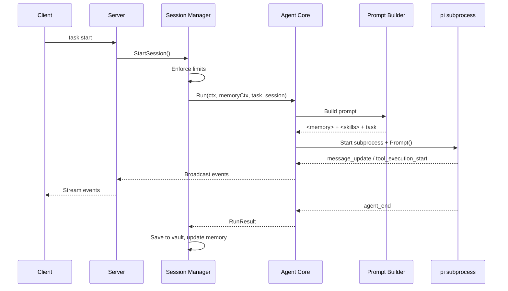

import { Aside } from '@astrojs/starlight/components';

## Task Flow



## Prompt Structure

The prompt is assembled by `PromptBuilder` in `internal/agent/prompt_builder.go`. It's optimized for Anthropic prompt caching — stable content comes first, dynamic content last.

```
┌────────────────────────────────┐
│ <memory>                       │  ← Stable prefix (cached)
│   User Profile (rendered)      │
│   Relevant History / Context   │
│ </memory>                      │
│                                │
│ <skill name="git-helper">      │  ← Matched per-task
│   Skill instructions...        │
│ </skill>                       │
│                                │
│ Task text from user            │  ← Always new (dynamic)
└────────────────────────────────┘
```

**Prompt caching**: The memory prefix rarely changes (profile updates are infrequent, history is compacted slowly), so it can be cached across multiple requests. The `PromptCache` in the memory engine handles this with a configurable TTL.

## Pi Subprocess Communication

Each session spawns a separate pi subprocess. Communication happens over stdin/stdout JSON RPC.

**Commands (Agent Core → pi):**

| Command | Key Fields | Purpose |
|---------|-----------|---------|
| `prompt` | `message` | Send the initial task prompt |
| `steer` | `message`, `streamingBehavior: "steer"` | Redirect the agent mid-task |
| `abort` | — | Cancel the current task |
| `extension_ui_response` | `id`, `confirmed`/`value`/`cancelled` | Reply to an HITL dialog request |

Commands are sent as JSON lines to pi's stdin. The task text always goes in the `message` field (not `text`).

**Events (pi → Agent Core):**

| Event | Purpose |
|-------|---------|
| `message_update` | Text/thinking delta from the agent (contains `assistantMessageEvent.type: "text_delta"`) |
| `tool_execution_start` | A tool is about to execute (`toolName`, `args`) |
| `tool_execution_end` | Tool execution result (`toolName`, `result.content`, `isError`) |
| `agent_end` | Task completed successfully |
| `auto_retry_end` | Task ended after retries (`success: false` + `finalError` if failed) |
| `extension_ui_request` | HITL approval needed (from extension) |

## Event Loop

The agent core runs a `select` loop that handles multiple channels simultaneously:

```go
select {
case <-doneCh:          // agent_end or auto_retry_end received from pi events
case <-b.Done():        // pi process exited (handles unexpected crashes)
case <-sess.AbortCh():  // client sent task.abort
case text := <-sess.SteerCh(): // client sent task.steer
case <-ctx.Done():      // context cancelled (timeout, shutdown)
}
```

- **Abort** closes the abort channel → agent core picks up → sends abort command to pi → session cleanup
- **Steer** sends text on a buffered channel (capacity 5) → agent core picks up → sends steer command to pi
- **Done** (`doneCh`) signals task completion via `agent_end` event → collect results → save to vault
- **b.Done()** signals pi process exit — if `doneCh` is not already closed, pi crashed unexpectedly → broadcast error

Early failures (pi launch or first prompt) also call `OnError` before returning, so the client always receives either `event.done` or `event.error`.

## Key Types

### RunResult

```go
type RunResult struct {
    Output    string        // Full transcript from pi
    Error     string        // Error message if failed
    ToolsUsed []string      // Unique tools called
    Stats     RunStats
}
```

### RunStats

```go
type RunStats struct {
    Tokens    int           // Estimated tokens (len(text)/4)
    ToolCalls int           // Number of unique tools used
    Duration  time.Duration
}
```

### Callbacks

Event routing from agent core to server for broadcasting to clients:

```go
type Callbacks struct {
    OnText        func(content string)
    OnToolUse     func(name string, input map[string]any)
    OnToolResult  func(name string, output string, success bool)
    OnHITLRequest func(requestId string, toolName string, details string)
    OnDone        func(output string, stats RunStats)
    OnError       func(msg string)
}
```

### SessionInterface

Minimal interface that decouples agent core from the session package:

```go
type SessionInterface interface {
    WaitHITL(requestId string, timeout time.Duration) (string, error)
    AbortCh() <-chan struct{}
    SteerCh() <-chan string
}
```

## Extension Loading

TypeScript extensions in the `extensions_dir` are automatically passed to pi via the `-e` flag. Each `.ts` or `.js` file in the directory is loaded as a separate extension.

If `pi.extensions_dir` is not set in config, AgentLoop auto-detects the `extensions/` directory relative to the server binary.

<Aside type="note">
  Extensions run inside the pi subprocess (Node.js), not the Go server. They have access to Node.js APIs and `process.env`. See [Pi Extensions Guide](/guides/pi-extensions/) for details.
</Aside>
