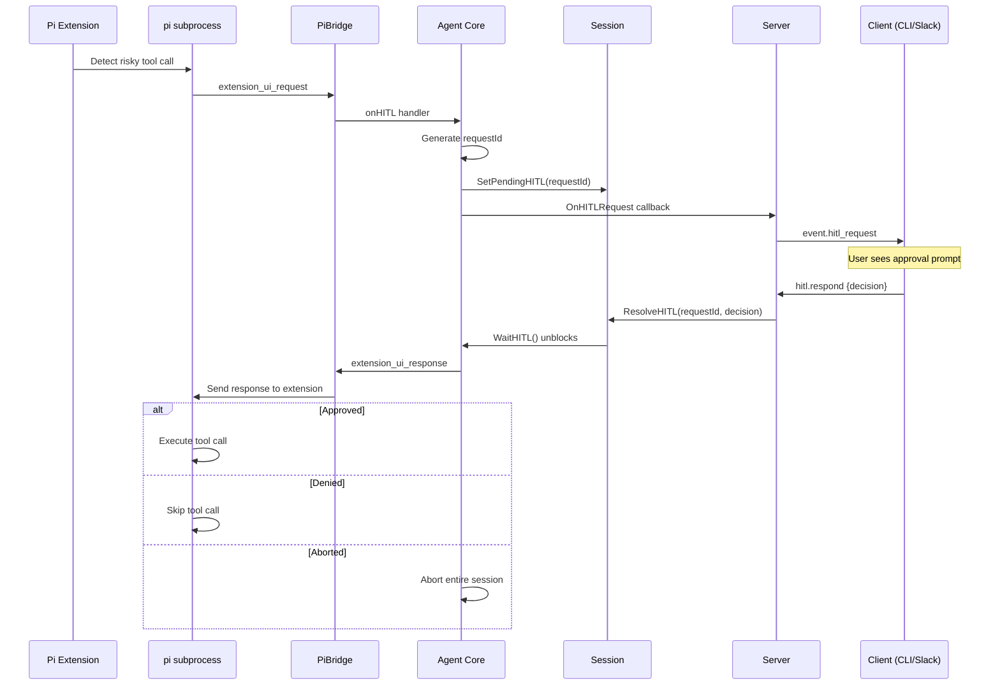

import { Aside } from '@astrojs/starlight/components';

## End-to-End Flow



## How HITL Is Triggered

Pi extensions can request human approval for any tool call using `ctx.ui.confirm()`:

```typescript
pi.on("toolCall", (ctx) => {
  if (isDangerous(ctx.tool)) {
    const approved = await ctx.ui.confirm(
      `Execute: ${ctx.tool.name}`,
      `Command: ${JSON.stringify(ctx.tool.input)}`
    );
    if (!approved) {
      return { action: "block", message: "Denied by user" };
    }
  }
  return { action: "continue" };
});
```

The `ctx.ui.confirm()` call triggers an `extension_ui_request` event from pi to the AgentLoop bridge.

## Always-Pause Tools

Certain tools always require HITL approval regardless of their input. Configure via `hitl.always_pause_tools`:

**Default always-pause tools:**
- `docker`
- `git push`
- `rm -r`
- `curl`
- `wget`

## HITL Request Payload

The `event.hitl_request` notification sent to clients:

```json
{
  "jsonrpc": "2.0",
  "method": "event.hitl_request",
  "params": {
    "sessionId": "sess-a1b2c3d4",
    "requestId": "hitl-req-1",
    "toolName": "bash",
    "details": "docker run -v ~/project:/app ubuntu:latest",
    "options": ["approve", "deny", "abort"]
  }
}
```

## HITL Response

Clients respond with `hitl.respond`:

```json
{
  "jsonrpc": "2.0",
  "id": 5,
  "method": "hitl.respond",
  "params": {
    "sessionId": "sess-a1b2c3d4",
    "requestId": "hitl-req-1",
    "decision": "approve"
  }
}
```

**Decision values:**
- `approve` — Execute the tool call
- `deny` (or `skip`) — Skip the tool call, agent continues
- `abort` — Cancel the entire session

## Timeout

If no response is received within `hitl.timeout_seconds` (default: **300 seconds** / 5 minutes), the server automatically applies the `hitl.timeout_action` (default: `deny`).

The session transitions back from `waiting_hitl` to `running` with the timeout decision.

## HITL in Different Clients

### CLI

The CLI prints a formatted prompt to the terminal:

```
⚠️  HITL: bash — docker run -v ~/project:/app ubuntu:latest
Approve? [y/n/abort]:
```

The user types `y`, `n`, or `abort` and presses Enter.

### Slack

The Slack Bridge posts a Block Kit message with three buttons:

```
🔒 Tool Approval Required
Tool: bash
Details: docker run -v ~/project:/app ubuntu:latest

[✅ Approve] [❌ Deny] [🛑 Abort Task]
```

After clicking, the message is updated to show the outcome (e.g., "Approved by @marco").

<Aside type="tip">
  HITL decisions are logged in the session's vault note under the "HITL Log" section, including the timestamp, tool name, and decision.
</Aside>
