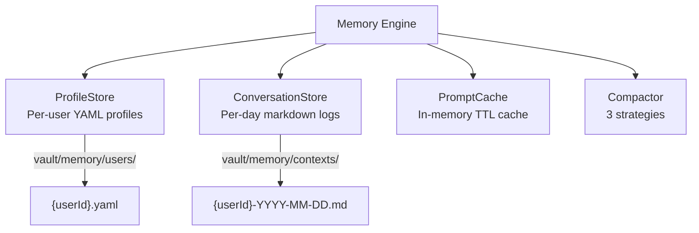
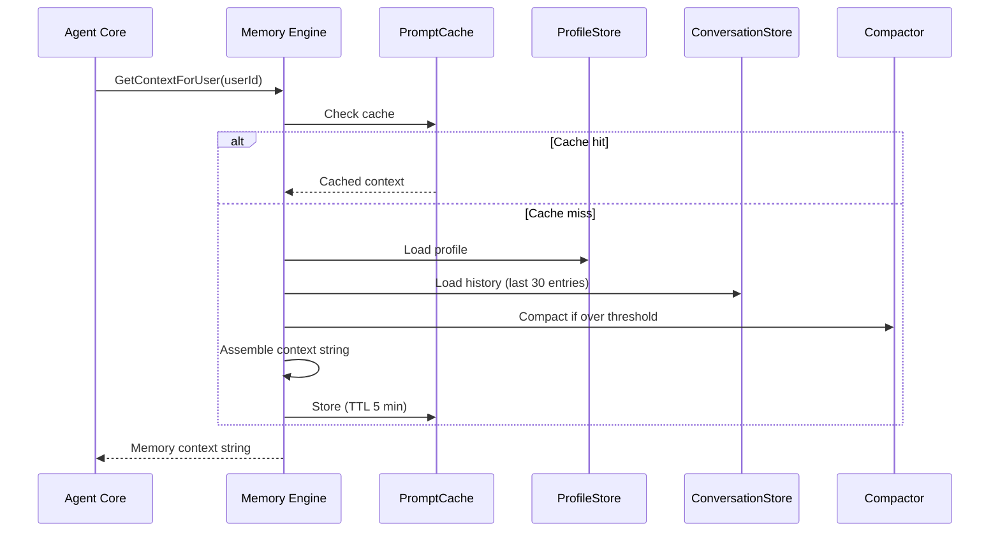

import { Aside } from '@astrojs/starlight/components';

## Architecture

The Memory Engine (`internal/memory/engine.go`) orchestrates four subsystems:



## Context Assembly Flow



### Task-Aware Context

When called with `GetContextForUserWithTask(userId, task)`, the engine uses an index-based scoring system:

1. Extract keywords and topics from the task text
2. Score each conversation entry by keyword overlap (Jaccard similarity) + topic bonus (+0.2)
3. Return top 8 matching entries, or 5 most recent if no matches found

## User Profiles

Stored as YAML in `vault/memory/users/<userId>.yaml`:

```go
type UserProfile struct {
    UserID             string            // User identifier
    Name               string            // Display name
    CommunicationStyle string            // Default: "concise, technical"
    Preferences        map[string]string // Key-value preferences
    FrequentProjects   []string          // Last 10 project paths
    ToolPreferences    []string          // Preferred tools
    FactSheet          map[string]string // Explicit user facts
    RecentTopics       []string          // Last 20 topics
    LastUpdated        string            // RFC3339 timestamp
}
```

The profile is rendered into the memory prompt via `Render()`:

```
User: marco
Communication style: concise, technical
Frequent projects: ~/travel-app, ~/agentloop
Recent topics: authentication, testing, deployment
Facts: timezone=Europe/Bratislava, language_preference=TypeScript
```

## Conversation Logs

Stored as per-user, per-day markdown files in `vault/memory/contexts/`:

**File naming:** `<userId>-YYYY-MM-DD.md`

**Entry format:**

```markdown
### HH:MM:SS [role]
Content of the message...
```

Each entry is also indexed in a sidecar file (`<userId>-YYYY-MM-DD.idx.json`) with:
- `ts` — Timestamp
- `role` — user or assistant
- `keywords` — Up to 15 keywords (4+ char words, stopwords filtered)
- `topics` — Matched topics from a 33-domain taxonomy
- `summary` — First 120 chars from first non-header line

**Retention:** Logs older than `memory.conversation_retain_days` (default: 30) are deleted.

## Compaction

When the conversation history exceeds `memory.compaction_threshold` (default: 40 entries), a compaction strategy runs. All strategies are heuristic-based — **no LLM calls**.

### Rolling Strategy (default)

Keep the last 5 turns verbatim. Summarize older entries as bullet points.

```
Recent conversation (last 5 turns preserved):
- Discussed authentication flow for travel-app
- Fixed failing test in user.go
- Deployed v1.2.0 to staging
[5 most recent full entries]
```

### Facts Strategy

Extract only action/decision lines — entries containing keywords like `decided`, `created`, `fixed`, `deployed`, `configured`, `implemented`.

### Topics Strategy

One entry per topic. Deduplicates by topic, keeping the most recent entry for each unique topic.

## Prompt Cache

An in-memory TTL cache (`PromptCache`) stores assembled context strings.

- **Key format:** `ctx:<userId>` or `ctx:<userId>:<taskCacheKey>`
- **TTL:** 5 minutes (hardcoded in engine)
- **Invalidation:** Any call to `RecordInteraction()`, `UpdateUserFact()`, or `ForgetUserFact()` invalidates the cache for that user

<Aside type="note">
  The cache is in-memory only — it's cleared on server restart. The `memory.prompt_cache_ttl_minutes` config field controls the configured TTL.
</Aside>

## Heuristic Learning

After every task completion, `RecordInteraction()` runs heuristic updates:

- **Project path extraction:** Detects `~/...` paths in user messages, adds to `FrequentProjects`
- **Topic tracking:** Matches message content against the 33-domain topic taxonomy, updates `RecentTopics`
- **Tool usage:** Records which tools were used, updates `ToolPreferences`

No LLM calls are made during profile updates — all learning is pattern-based.
