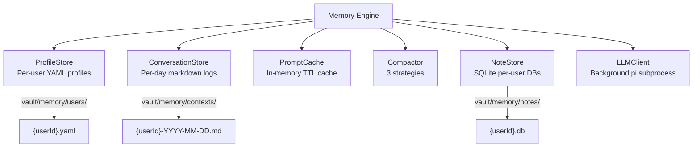
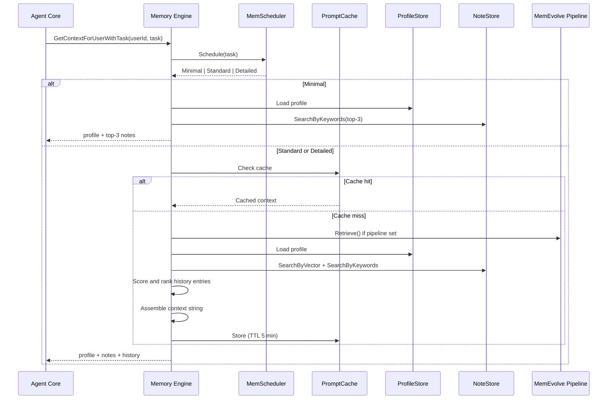

import { Aside } from '@astrojs/starlight/components';

## Architecture

The Memory Engine (`internal/memory/engine.go`) orchestrates six subsystems:


```mermaid
graph TD
    Engine["Memory Engine"]
    PS["ProfileStore<br/>Per-user YAML profiles"]
    CS["ConversationStore<br/>Per-day markdown logs"]
    PC["PromptCache<br/>In-memory TTL cache"]
    Comp["Compactor<br/>3 strategies"]
    NS["NoteStore<br/>SQLite per-user DBs"]
    LLM["LLMClient<br/>Background pi subprocess"]

    Engine --> PS
    Engine --> CS
    Engine --> PC
    Engine --> Comp
    Engine --> NS
    Engine --> LLM

    PS -->|vault/memory/users/| Files1["{userId}.yaml"]
    CS -->|vault/memory/contexts/| Files2["{userId}-YYYY-MM-DD.md"]
    NS -->|vault/memory/notes/| Files3["{userId}.db"]
```

## Context Assembly Flow

`GetContextForUserWithTask(userId, task)` routes through the **MemScheduler** first, which selects the retrieval depth based on task complexity:


```mermaid
sequenceDiagram
    participant AC as Agent Core
    participant ME as Memory Engine
    participant Sched as MemScheduler
    participant Cache as PromptCache
    participant PS as ProfileStore
    participant NS as NoteStore
    participant PL as MemEvolve Pipeline

    AC->>ME: GetContextForUserWithTask(userId, task)
    ME->>Sched: Schedule(task)
    Sched-->>ME: Minimal | Standard | Detailed

    alt Minimal
        ME->>PS: Load profile
        ME->>NS: SearchByKeywords(top-3)
        ME-->>AC: profile + top-3 notes
    else Standard or Detailed
        ME->>Cache: Check cache
        alt Cache hit
            Cache-->>ME: Cached context
        else Cache miss
            ME->>PL: Retrieve() if pipeline set
            ME->>PS: Load profile
            ME->>NS: SearchByVector + SearchByKeywords
            ME->>ME: Score and rank history entries
            ME->>ME: Assemble context string
            ME->>Cache: Store (TTL 5 min)
        end
        ME-->>AC: profile + notes + history
    end
```

### Context Levels

| Level | Trigger | What's included |
|-------|---------|-----------------|
| **Minimal** | ≤3 words, no complexity keywords | Profile + top-3 keyword-matched notes (~500 tokens) |
| **Standard** | 4–25 words | Profile + top-8 notes + compacted history |
| **Detailed** | >25 words or complexity keyword | Profile + top-16 notes + full history |

**Complexity keywords** that force Detailed: `refactor`, `architect`, `redesign`, `migrate`, `integrate`, `security`, `performance`, `debug`, `analyse`, `analyze`.

## User Profiles

Stored as YAML in `vault/memory/users/<userId>.yaml`:

```go
type UserProfile struct {
    UserID             string            // User identifier
    Name               string            // Display name
    CommunicationStyle string            // Default: "concise, technical"
    Preferences        map[string]string // Key-value preferences
    FrequentProjects   []string          // Last 10 project paths
    ToolPreferences    []string          // Preferred tools
    FactSheet          map[string]string // Explicit user facts
    RecentTopics       []string          // Last 20 topics
    LastUpdated        string            // RFC3339 timestamp
}
```

The profile is rendered into the memory prompt via `Render()`:

```
User: marco
Communication style: concise, technical
Frequent projects: ~/travel-app, ~/agentloop
Recent topics: authentication, testing, deployment
Facts: timezone=Europe/Bratislava, language_preference=TypeScript
```

## Conversation Logs

Stored as per-user, per-day markdown files in `vault/memory/contexts/`:

**File naming:** `<userId>-YYYY-MM-DD.md`

**Entry format:**

```markdown
### HH:MM:SS [role]
Content of the message...
```

Each entry is also indexed in a sidecar file (`<userId>-YYYY-MM-DD.idx.json`) with:
- `ts` — Timestamp
- `role` — user or assistant
- `keywords` — Up to 15 keywords (4+ char words, stopwords filtered)
- `topics` — Matched topics from a 33-domain taxonomy
- `summary` — First 120 chars from first non-header line

**Retention:** Logs older than `memory.conversation_retain_days` (default: 30) are deleted.

## Atomic Notes

Atomic notes are self-contained units of knowledge stored in per-user SQLite databases at `vault/memory/notes/<userId>.db`. Each note holds one idea with keywords, tags, and an optional vector embedding for dual-mode retrieval.

Notes appear in the assembled context under a `## Memory Notes` block:

```
## Memory Notes (3 relevant)
- [note-a1b2c3d4] user prefers Go over Python for backends
- [note-e5f6g7h8] project uses Postgres, not MySQL
- [note-i9j0k1l2] always run tests before committing
```

### How Notes Are Created

**Automatically (ACE delta extraction):** When `memory.agent.enabled: true`, after every task a background subprocess extracts one atomic "preference delta" from the conversation and saves it as a note.

**By the agent:** The agent uses `Add_memory`, `Update_memory`, and `Delete_memory` tools when it detects a new preference, a correction, or a framework switch. See [Memory & Profiles](/guides/memory-and-profiles/) for tool usage.

### Retrieval

When assembling context, the engine runs two searches and deduplicates:

1. **Vector search** — cosine similarity on embeddings (requires `memory.embedding_dims > 0` and `memory.agent.enabled: true`)
2. **Keyword search** — Jaccard overlap on extracted keywords (always runs)

### Semantic Auto-Linking

When a note is added via `Engine.AddNote()`, it is automatically connected to the top-3 keyword-related existing notes. Connections are bidirectional.

## Compaction

When the conversation history exceeds `memory.compaction_threshold` (default: 40 entries), a compaction strategy runs. All strategies are heuristic-based — **no LLM calls**.

### Rolling Strategy (default)

Keep the last 5 turns verbatim. Summarize older entries as bullet points.

### Facts Strategy

Extract only action/decision lines — entries containing keywords like `decided`, `created`, `fixed`, `deployed`, `configured`, `implemented`.

### Topics Strategy

One entry per topic. Deduplicates by topic, keeping the most recent entry for each unique topic.

## Prompt Cache

An in-memory TTL cache (`PromptCache`) stores assembled context strings.

- **Key format:** `ctx:<userId>` or `ctx:<userId>:<taskCacheKey>`
- **TTL:** 5 minutes (hardcoded in engine)
- **Invalidation:** Any call to `RecordInteraction()`, `UpdateUserFact()`, `ForgetUserFact()`, `AddNote()`, `UpdateNote()`, or `DeleteNote()` invalidates the cache for that user

<Aside type="note">
  The cache is in-memory only — it's cleared on server restart. The `memory.prompt_cache_ttl_minutes` config field controls the configured TTL.
</Aside>

## Heuristic Learning

After every task completion, `RecordInteraction()` runs heuristic updates:

- **Project path extraction:** Detects `~/...` paths in user messages, adds to `FrequentProjects`
- **Topic tracking:** Matches message content against the 33-domain topic taxonomy, updates `RecentTopics`
- **Tool usage:** Records which tools were used, updates `ToolPreferences`
- **ACE delta extraction:** If `memory.agent.enabled: true`, a background goroutine uses the LLM client to extract one atomic note from the conversation turn and saves it to the note store

The first three are pattern-based and make no LLM calls. ACE delta extraction requires a configured background pi subprocess.

<Aside type="tip">
**Self-Evolving Memory**

AgentLoop includes MemEvolve, a pipeline that observes task outcomes and improves memory retrieval automatically over time. See [The Memory Pipeline](/memevolve/how-memory-works) for the full pipeline architecture and interface reference.
</Aside>

<Aside type="tip">
**Orchestrator Integration**

The [Orchestrator](/orchestrator/overview/) uses the Memory Engine to provide user context to all three agent roles (Planner, Worker, Judge). Orchestration outcomes also feed back into MemEvolve for continuous improvement. See [Orchestrator Configuration](/orchestrator/configuration/) for details.
</Aside>
