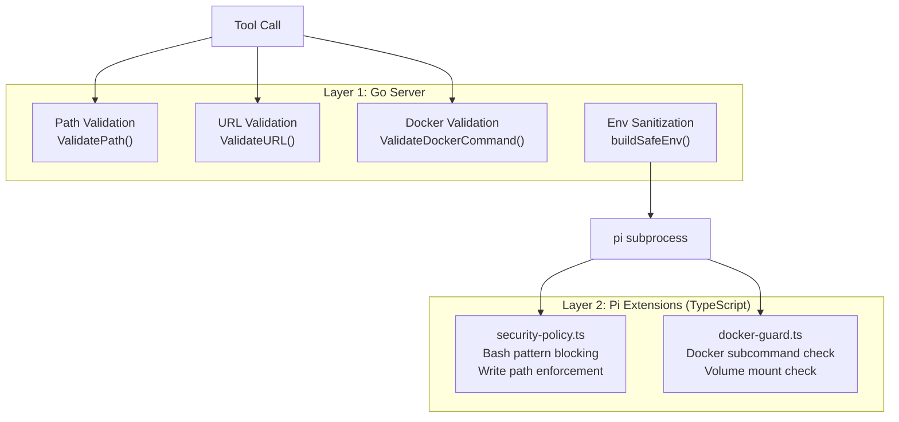

import { Aside } from '@astrojs/starlight/components';

## Defense in Depth

AgentLoop enforces security at two independent layers:



Even if one layer is bypassed, the other provides protection.

## Go-Side Security (`internal/security/policy.go`)

### Path Validation

`ValidatePath(path, allowedPaths)` prevents directory traversal and enforces allowed paths:

1. Applies `filepath.Clean()` to canonicalize the path
2. Expands `~/` to the user's home directory
3. Checks that the cleaned path starts with one of the `allowed_paths` (prefix match with path separator)
4. Blocks any path containing `..` traversal

```go
// Blocked:
ValidatePath("../../etc/passwd", allowedPaths) // → error: path traversal
ValidatePath("/var/secrets/key", allowedPaths)  // → error: not in allowed paths

// Allowed:
ValidatePath("~/projects/myapp/main.go", allowedPaths) // → nil
```

### URL Validation (SSRF Protection)

`ValidateURL(rawURL, blockedCIDRs, allowedDomains)` prevents Server-Side Request Forgery:

1. Requires `http` or `https` scheme
2. If `allowedDomains` is set, checks domain against whitelist (exact or suffix match)
3. Resolves the hostname via DNS
4. Checks all resolved IPs against `blocked_cidrs` to catch private/internal network access

Default blocked CIDRs include all private and loopback ranges:
- `10.0.0.0/8`, `172.16.0.0/12`, `192.168.0.0/16`
- `127.0.0.0/8`, `169.254.0.0/16`
- `fc00::/7`, `::1/128`, `fe80::/10`

<Aside type="caution">
  `ValidateURL()` performs real DNS lookups. Tests that call it need network access or should mock the DNS resolution.
</Aside>

### Docker Validation

`ValidateDockerCommand(cmd, allowedSubs, blockedVolPaths)` restricts docker usage:

1. Parses the bash command for `docker` or `docker-compose` invocations
2. Checks the subcommand against `docker_allowed_subcommands` whitelist
3. Validates volume mounts (`-v` or `--volume`) against `docker_blocked_volume_paths`
4. Blocks `--privileged` and `--network host` flags

Default allowed subcommands: `ps`, `logs`, `images`, `build`, `compose`, `inspect`, `stats`, `top`, `exec`, `run`, `stop`, `start`, `restart`, `rm`

Default blocked volume paths: `/etc`, `/var`, `/root`, `/proc`, `/sys`, `/dev`

## Environment Sanitization

`buildSafeEnv()` in `internal/bridge/rpc.go` creates a clean environment for pi subprocesses:

1. Copies the current process environment
2. Removes all variables matching `security.blocked_env_prefixes`
3. Passes the sanitized environment to the pi subprocess

Default blocked prefixes:
- `ANTHROPIC_`, `OPENAI_`, `BRAVE_SEARCH_`
- `N8N_WEBHOOK_`, `AWS_SECRET`
- `GITHUB_TOKEN`, `SECRET_KEY`, `PRIVATE_KEY`

<Aside type="note">
  API keys are passed to pi through the sanitized environment — they are needed for LLM calls. The blocked prefixes strip *additional* sensitive keys that pi should not have access to (e.g., webhook secrets, AWS credentials).
</Aside>

## Extension-Level Enforcement

### security-policy.ts

Intercepts bash tool calls and blocks dangerous patterns:

**Blocked bash commands:**
- `rm -rf /`, `sudo rm`, `mkfs`, `> /dev/sd`
- `dd if=` (disk write)
- `:(){ :|:& };:` (fork bomb)

**Blocked environment exfiltration:**
- `printenv`, `env |`
- `echo $ANTHROPIC`, `echo $OPENAI`
- `cat /proc/*/environ`

**Write path enforcement:**
- Reads `AGENTLOOP_ALLOWED_PATHS` from environment
- Validates file write/edit paths against allowed paths
- Resolves to absolute paths before checking

### docker-guard.ts

Intercepts bash tool calls containing docker commands:

- Reads `AGENTLOOP_DOCKER_ALLOWED` for allowed subcommands
- Reads `AGENTLOOP_DOCKER_BLOCKED_VOLS` for blocked volume mount paths
- Blocks commands with unauthorized subcommands or dangerous volume mounts

## Socket Permissions

The Unix socket is created with `0700` permissions (owner-only access). The server removes stale sockets on startup.
