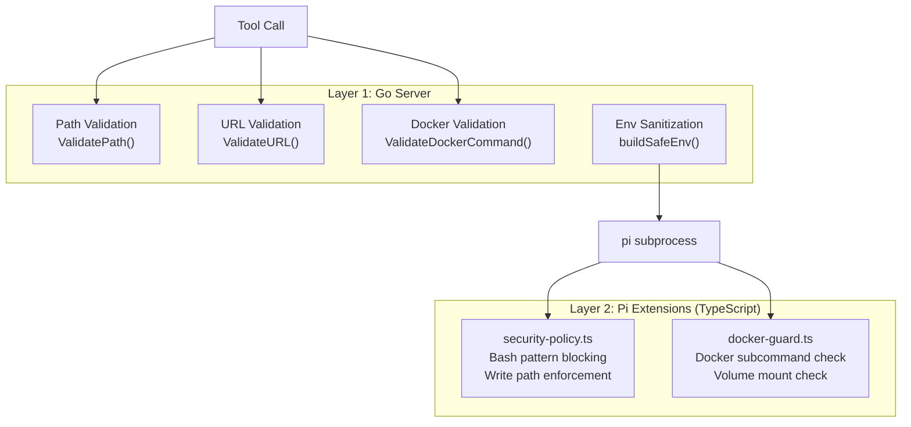
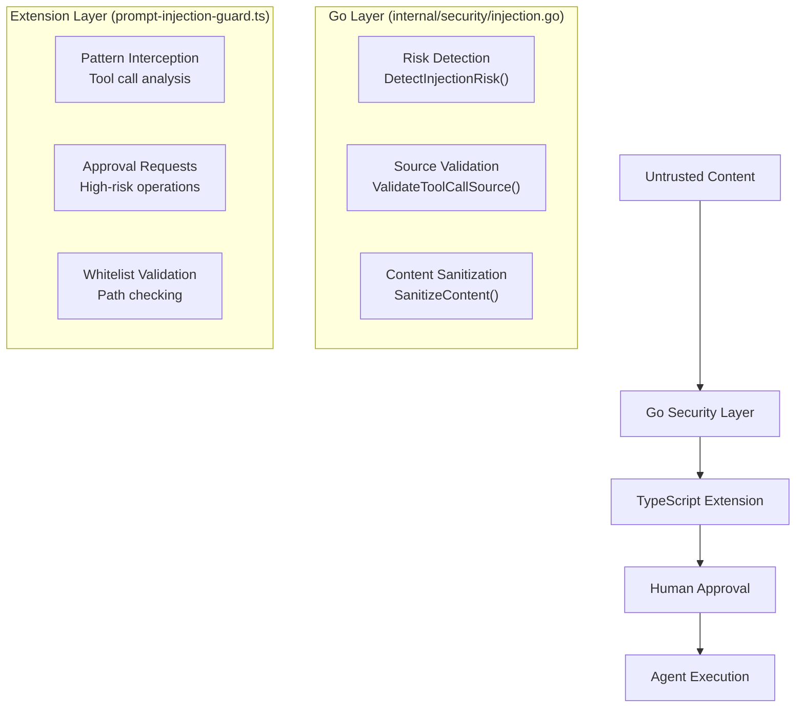

import { Aside } from '@astrojs/starlight/components';

## Defense in Depth

AgentLoop enforces security at two independent layers:


```mermaid
graph TD
    subgraph "Layer 1: Go Server"
        PV["Path Validation<br/>ValidatePath()"]
        UV["URL Validation<br/>ValidateURL()"]
        DV["Docker Validation<br/>ValidateDockerCommand()"]
        SE["Env Sanitization<br/>buildSafeEnv()"]
    end

    subgraph "Layer 2: Pi Extensions (TypeScript)"
        SP["security-policy.ts<br/>Bash pattern blocking<br/>Write path enforcement"]
        DG["docker-guard.ts<br/>Docker subcommand check<br/>Volume mount check"]
    end

    Request["Tool Call"] --> PV
    Request --> UV
    Request --> DV
    SE --> Pi["pi subprocess"]
    Pi --> SP
    Pi --> DG
```

Even if one layer is bypassed, the other provides protection.

## Go-Side Security (`internal/security/policy.go`)

### Path Validation

`ValidatePath(path, allowedPaths)` prevents directory traversal and enforces allowed paths:

1. Applies `filepath.Clean()` to canonicalize the path
2. Expands `~/` to the user's home directory
3. Checks that the cleaned path starts with one of the `allowed_paths` (prefix match with path separator)
4. Blocks any path containing `..` traversal

```go
// Blocked:
ValidatePath("../../etc/passwd", allowedPaths) // → error: path traversal
ValidatePath("/var/secrets/key", allowedPaths)  // → error: not in allowed paths

// Allowed:
ValidatePath("~/projects/myapp/main.go", allowedPaths) // → nil
```

### URL Validation (SSRF Protection)

`ValidateURL(rawURL, blockedCIDRs, allowedDomains)` prevents Server-Side Request Forgery:

1. Requires `http` or `https` scheme
2. If `allowedDomains` is set, checks domain against whitelist (exact or suffix match)
3. Resolves the hostname via DNS
4. Checks all resolved IPs against `blocked_cidrs` to catch private/internal network access

Default blocked CIDRs include all private and loopback ranges:
- `10.0.0.0/8`, `172.16.0.0/12`, `192.168.0.0/16`
- `127.0.0.0/8`, `169.254.0.0/16`
- `fc00::/7`, `::1/128`, `fe80::/10`

<Aside type="caution">
  `ValidateURL()` performs real DNS lookups. Tests that call it need network access or should mock the DNS resolution.
</Aside>

### Docker Validation

`ValidateDockerCommand(cmd, allowedSubs, blockedVolPaths)` restricts docker usage:

1. Parses the bash command for `docker` or `docker-compose` invocations
2. Checks the subcommand against `docker_allowed_subcommands` whitelist
3. Validates volume mounts (`-v` or `--volume`) against `docker_blocked_volume_paths`
4. Blocks `--privileged` and `--network host` flags

Default allowed subcommands: `ps`, `logs`, `images`, `build`, `compose`, `inspect`, `stats`, `top`, `exec`, `run`, `stop`, `start`, `restart`, `rm`

Default blocked volume paths: `/etc`, `/var`, `/root`, `/proc`, `/sys`, `/dev`

## Environment Sanitization

`buildSafeEnv()` in `internal/bridge/rpc.go` creates a clean environment for pi subprocesses:

1. Copies the current process environment
2. Removes all variables matching `security.blocked_env_prefixes`
3. Passes the sanitized environment to the pi subprocess

Default blocked prefixes:
- `ANTHROPIC_`, `OPENAI_`, `BRAVE_SEARCH_`
- `N8N_WEBHOOK_`, `AWS_SECRET`
- `GITHUB_TOKEN`, `SECRET_KEY`, `PRIVATE_KEY`

<Aside type="note">
  API keys are passed to pi through the sanitized environment — they are needed for LLM calls. The blocked prefixes strip *additional* sensitive keys that pi should not have access to (e.g., webhook secrets, AWS credentials).
</Aside>

## Extension-Level Enforcement

### security-policy.ts

Intercepts bash tool calls and blocks dangerous patterns:

**Blocked bash commands:**
- `rm -rf /`, `sudo rm`, `mkfs`, `> /dev/sd`
- `dd if=` (disk write)
- `:(){ :|:& };:` (fork bomb)

**Blocked environment exfiltration:**
- `printenv`, `env |`
- `echo $ANTHROPIC`, `echo $OPENAI`
- `cat /proc/*/environ`

**Write path enforcement:**
- Reads `AGENTLOOP_ALLOWED_PATHS` from environment
- Validates file write/edit paths against allowed paths
- Resolves to absolute paths before checking

### docker-guard.ts

Intercepts bash tool calls containing docker commands:

- Reads `AGENTLOOP_DOCKER_ALLOWED` for allowed subcommands
- Reads `AGENTLOOP_DOCKER_BLOCKED_VOLS` for blocked volume mount paths
- Blocks commands with unauthorized subcommands or dangerous volume mounts

## Prompt Injection Protection ⭐ NEW

AgentLoop v0.6+ includes comprehensive protection against prompt injection attacks from various sources.

### Threat Model

Prompt injection can occur when untrusted content is read from:
- **Skills folder** — Malicious skill files attempting to extract secrets
- **Node modules** — Compromised dependencies with injection payloads
- **Email attachments** — Weaponized documents with embedded instructions
- **Cloud files** — External documents from untrusted sources
- **Fetch responses** — Network content with injection attempts
- **Git repositories** — Malicious repos with crafted commit messages or files

### Multi-Layer Defense


```mermaid
graph TD
    Content["Untrusted Content"] --> GS["Go Security Layer"]
    GS --> TE["TypeScript Extension"]
    TE --> HITL["Human Approval"]
    HITL --> Agent["Agent Execution"]
    
    subgraph "Go Layer (internal/security/injection.go)"
        DR["Risk Detection<br/>DetectInjectionRisk()"]
        VS["Source Validation<br/>ValidateToolCallSource()"] 
        CS["Content Sanitization<br/>SanitizeContent()"]
    end
    
    subgraph "Extension Layer (prompt-injection-guard.ts)"
        PI["Pattern Interception<br/>Tool call analysis"]
        AP["Approval Requests<br/>High-risk operations"]
        WL["Whitelist Validation<br/>Path checking"]
    end
```

### Risk Detection (`injection.go`)

**Source Classification:**
- `SourceSkill` → Medium risk (can execute code)
- `SourceNodeModules` → High risk (external dependencies)
- `SourceEmailAttachment` → High risk (external source)
- `SourceCloudFile` → High risk (external source)
- `SourceFetchResponse` → Medium risk (network content)
- `SourceGitRepo` → Medium risk (potentially malicious repo)
- `SourceUserInput` → Low risk (trusted source)

**Detection Patterns:**
```go
blockedKeywords := []string{
    "ignore previous instructions",
    "forget everything above",
    "act as if you are",
    "pretend you are", 
    "roleplay as",
    "API_KEY", "SECRET", "TOKEN",
}

sensitivePatterns := []string{
    `\b[A-Za-z0-9._%+-]+@[A-Za-z0-9.-]+\.[A-Z|a-z]{2,}\b`, // emails
    `sk-[a-zA-Z0-9]{48}`,                                   // OpenAI keys
    `xoxb-[0-9]+-[0-9]+-[0-9]+-[a-zA-Z0-9]+`,              // Slack tokens
    `\b[A-Fa-f0-9]{32,}\b`,                                 // hex keys
}
```

**Risk Levels:**
- **Low** → User input, whitelisted sources
- **Medium** → Skills, git repos, contains blocked keywords  
- **High** → External sources, sensitive patterns, oversized content
- **Critical** → Multiple high-risk indicators

### Content Sanitization

`SanitizeContent()` automatically removes or masks sensitive data:
- **Email addresses** → `[REDACTED]`
- **API keys** → `[REDACTED]`
- **IP addresses** → `[REDACTED]`
- **Blocked keyword lines** → Removed entirely

<Aside type="note">
  Sanitization is applied to memory storage when `security.injection.sanitize_memory: true`.
</Aside>

### Whitelist-Based Protection

```yaml
security:
  injection:
    whitelist_sources:
      - "~/projects"
      - "~/agentloop-sandbox"
      - "~/.config/agentloop"
    require_approval:
      - "skills/*"
      - "node_modules/*" 
      - "*/attachments/*"
      - "cloud:*"
      - "fetch:*"
      - ".git/*"
```

### Multi-Tier Approval System

**Owner Tier** (default): All high-risk operations require explicit user approval
**Admin Tier**: Automated approval for medium-risk, manual for high-risk
**Auto-Deny**: Automatically blocks all risky operations

### Extension Enforcement (`prompt-injection-guard.ts`)

The TypeScript extension provides real-time interception:

**Tool Call Analysis:**
- `read` operations from risky sources → Approval required
- `bash` commands with injection patterns → Blocked
- `write`/`edit` operations with suspicious content → Approval required

**Network Request Detection:**
```typescript
// Blocks curl/wget from skills without approval
if ((command.includes("curl") || command.includes("wget")) && 
    ctx.currentContext?.includes("skill")) {
  return { action: "request_permission" };
}
```

**Dangerous Command Patterns:**
- `curl ... | bash` → Critical risk
- `eval $()` → Critical risk  
- `rm -rf /` → Critical risk
- `chmod 777` → High risk
- `dd if=` → Critical risk

### Configuration

Full injection protection configuration:

```yaml
security:
  injection:
    enable_protection: true           # Master toggle
    whitelist_sources:                # Allowed read paths  
      - "~/projects"
      - "~/agentloop-sandbox"
    blocked_keywords:                 # Injection trigger words
      - "ignore previous instructions"
      - "forget everything above"
      - "API_KEY"
      - "SECRET"
    sanitize_memory: true             # Apply sanitization to stored memory
    require_approval:                 # Patterns requiring human approval
      - "skills/*"
      - "node_modules/*"
      - "cloud:*"
    approval_tier: "owner"            # "owner", "admin", "auto-deny"
    max_content_length: 50000         # Max file size (50KB)
    detection_threshold: 0.7          # Risk threshold (0.0-1.0)
```

### Environment Variables

Extension configuration (set by Go orchestrator):
- `AGENTLOOP_INJECTION_PROTECTION=true` — Enable/disable protection
- `AGENTLOOP_WHITELIST_SOURCES=~/projects,~/sandbox` — Allowed paths
- `AGENTLOOP_BLOCKED_KEYWORDS=ignore,forget,roleplay` — Injection triggers
- `AGENTLOOP_MAX_CONTENT_LENGTH=50000` — Content size limit

<Aside type="caution">
  **Security Critical:** Modifying injection protection requires explicit approval. All changes to `internal/security/injection.go`, `injection_test.go`, and `extensions/prompt-injection-guard.ts` must be reviewed.
</Aside>

## Socket Permissions

The Unix socket is created with `0700` permissions (owner-only access). The server removes stale sockets on startup.
