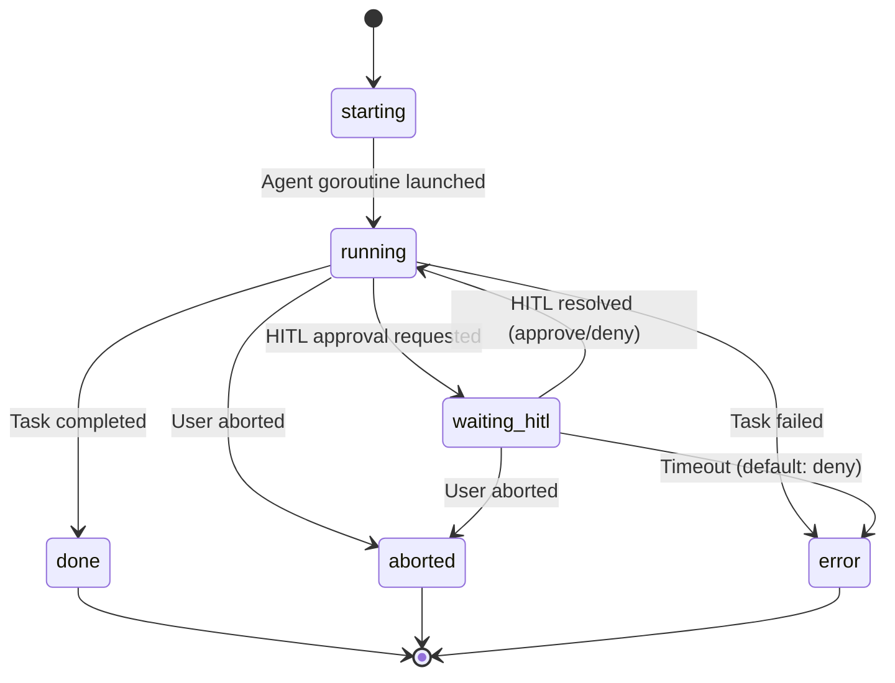

import { Aside } from '@astrojs/starlight/components';

## State Machine



### States

| State | Meaning | Entry Trigger | Exit Trigger |
|-------|---------|---------------|--------------|
| `starting` | Session created, agent goroutine launching | `task.start` received | Agent core begins execution |
| `running` | Agent actively processing | Agent started or HITL resolved | Task completes, aborted, error, or HITL request |
| `waiting_hitl` | Blocked on human approval | Pi extension requests confirmation | User responds or timeout |
| `done` | Task completed successfully | Agent core returns result | Terminal state |
| `aborted` | User cancelled the task | `task.abort` received | Terminal state |
| `error` | Task failed | Unrecoverable error | Terminal state |

## Session Limits

The Session Manager enforces concurrency limits before creating a new session:

| Config Field | Default | Purpose |
|---|---|---|
| `sessions.max_concurrent` | 3 | Maximum total active sessions across all users |
| `sessions.max_per_user` | 1 | Maximum active sessions per user |
| `sessions.timeout_minutes` | 30 | Session timeout |
| `sessions.max_token_budget` | 200,000 | Maximum tokens per session |
| `sessions.max_tool_calls` | 100 | Maximum tool calls per session |
| `sessions.stuck_threshold` | 3 | Consecutive errors before stuck detection |

If limits are exceeded, `StartSession()` returns an error immediately.

## Session IDs

Format: `sess-<uuid[:8]>` (e.g., `sess-a1b2c3d4`)

Generated using the first 8 characters of a UUID v4. Collision risk is negligible for the expected session volume.

## Steer Flow

Redirect a running task to a new direction:

```
Client sends: task.steer {sessionId, text}
    │
    ▼
handler.go → session.Steer(text)
    │
    ▼
Buffered channel (capacity 5) receives text
    │
    ▼
Agent core select loop picks up from SteerCh()
    │
    ▼
PiBridge.Steer(text) → sends steer command to pi subprocess
```

The steer channel has capacity 5. If 5 steers are pending, additional steers are dropped.

## Abort Flow

Cancel a running task:

```
Client sends: task.abort {sessionId}
    │
    ▼
handler.go → session.Abort()
    │
    ▼
Close abort channel (abortCh)
    │
    ▼
Agent core select loop picks up from AbortCh()
    │
    ▼
PiBridge.Abort() → sends abort command to pi subprocess
    │
    ▼
Session state → aborted
    │
    ▼
Session cleanup: removed from manager maps
```

## HITL Resolution

When a HITL request is pending:

1. `session.SetPendingHITL(requestId)` creates a decision channel
2. `session.WaitHITL(requestId, timeout)` blocks until a decision arrives
3. Client sends `hitl.respond` with the sessionId, requestId, and decision
4. `session.ResolveHITL(requestId, decision)` sends decision on the channel
5. Agent core receives the decision and continues or blocks

Default HITL timeout: 300 seconds. Default timeout action: `deny`.

## Session Cleanup

When a session reaches a terminal state (`done`, `aborted`, `error`):

1. Session removed from the manager's session map
2. Session removed from the user's session list (`userMap`)
3. Session persisted to vault via `ToVaultNote()`
4. Memory updated via `RecordInteraction()`

## Vault Persistence

Completed sessions are saved as Markdown files with YAML frontmatter:

**Location:** `~/.local/share/agentloop/vault/sessions/`
**Filename:** `YYYY-MM-DD-sess-<uuid8>.md`

```markdown
---
id: sess-a1b2c3d4
title: Fix failing tests in user.go
created: 2026-02-27T14:00:00Z
updated: 2026-02-27T14:03:25Z
status: done
provider: anthropic
model: claude-sonnet-4-20250514
source: cli
user_id: marco
tags: []
---

## Task
Fix failing tests in user.go

## Tools Used
- bash
- edit

## HITL Log
- 14:00:05 | docker | approve

## Transcript
...
```

## SessionInfo Response

When listing sessions via `session.list`:

```go
type SessionInfo struct {
    ID     string // "sess-a1b2c3d4"
    UserID string
    Task   string
    State  State  // "starting", "running", "waiting_hitl", "done", etc.
    Source string // "cli", "slack"
    Start  string // RFC3339 timestamp
}
```
