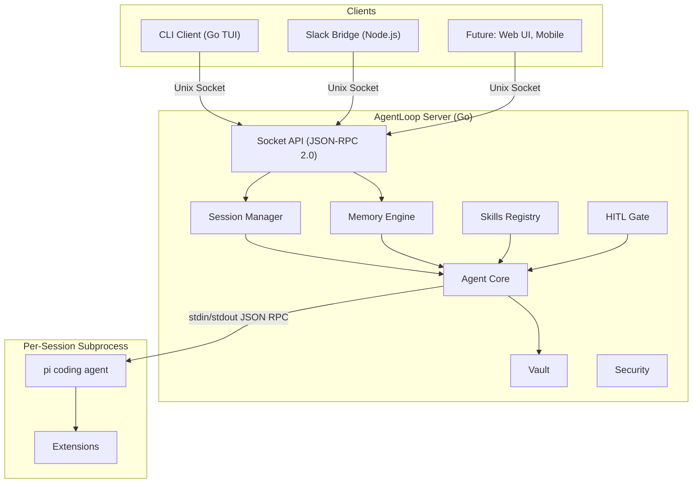

import { Aside } from '@astrojs/starlight/components';

## Why a Long-Running Server?

AgentLoop runs as a persistent server process rather than an embedded library. This design enables:

- **Multi-client support** — CLI, Slack, and future clients connect to the same server simultaneously
- **Persistent memory** — User profiles and conversation history survive across sessions and restarts
- **Shared state** — All clients see the same sessions, memory, and skills
- **Process isolation** — Pi subprocesses are managed centrally with consistent security policies

## Architecture



## Unix Socket & JSON-RPC 2.0

The server listens on a Unix domain socket at `~/.local/share/agentloop/agentloop.sock` with `0700` permissions (owner-only access).

**Why JSON-RPC 2.0:**
- Simple request/response + notification model
- Language-agnostic — any client that can read/write Unix sockets works
- Newline-delimited messages — easy to parse with line-based readers

**Message format:** Each JSON message is a single line terminated by `\n`.

### Requests (Client → Server)

Requests have an `id` field. The server responds with a matching `id`.

```json
{"jsonrpc":"2.0","id":1,"method":"task.start","params":{"userId":"marco","text":"fix tests","source":"cli"}}
```

### Notifications (Server → Client)

Notifications have a `method` field but **no `id`**. Clients cannot respond to them.

```json
{"jsonrpc":"2.0","method":"event.text","params":{"sessionId":"sess-a1b2c3d4","content":"Looking at the test files..."}}
```

### Connection Lifecycle

1. Client connects to Unix socket
2. Client sends `task.start` → receives the session ID and status, and auto-subscribes to that session's events
3. Server streams `event.*` notifications as the agent works
4. On completion: `event.done` is broadcast, session is persisted to vault
5. Client can send `task.steer` to redirect or `task.abort` to cancel

## Subsystem Overview

| Subsystem | Package | Purpose |
|-----------|---------|---------|
| [Socket API](/reference/socket-api/) | `internal/server` | Unix socket listener, JSON-RPC dispatch, client management |
| [Session Manager](/architecture/session-lifecycle/) | `internal/session` | Session lifecycle, concurrency limits, routing |
| [Agent Core](/architecture/agent-core/) | `internal/agent` | Prompt building, pi subprocess management, event loop |
| [Memory Engine](/architecture/memory-system/) | `internal/memory` | Profiles, conversation logs, compaction, caching |
| [Skills Registry](/guides/skills/) | `internal/skills` | On-demand instruction injection |
| [HITL Gate](/architecture/hitl-flow/) | `internal/hitl` | Human approval flow types and formatting |
| [Vault](/guides/vault-and-obsidian/) | `internal/vault` | Session persistence, Obsidian-compatible markdown |
| [Security](/architecture/security-model/) | `internal/security` | Path validation, SSRF protection, docker guards |
| Config | `internal/config` | YAML config with Viper, env var overrides |
| Bridge | `internal/bridge` | Pi subprocess RPC communication |

## Data Flow

```
task.start request
    │
    ▼
server/handler.go → session.Manager.StartSession()
    │
    ├─ 1. Enforce limits (MaxConcurrent, MaxPerUser)
    ├─ 2. Create Session (id=sess-{uuid8}, state=starting)
    ├─ 3. Subscribe client to session events
    ├─ 4. Launch agent goroutine:
    │      agent.Core.Run(ctx, memoryContext, task, session)
    │      ├─ Build prompt: <memory>...</memory> + task text
    │      ├─ Create PiBridge, register event + HITL handlers
    │      ├─ bridge.Start() launches pi subprocess
    │      ├─ bridge.Prompt() sends task
    │      └─ Event loop: done/abort/steer/ctx.Done()
    ├─ 5. Events broadcast to subscribed clients via socket
    ├─ 6. HITL requests → event.hitl_request → client → hitl.respond
    ├─ 7. On completion: save to vault, update memory, broadcast event.done
    └─ 8. Cleanup session from manager
```
