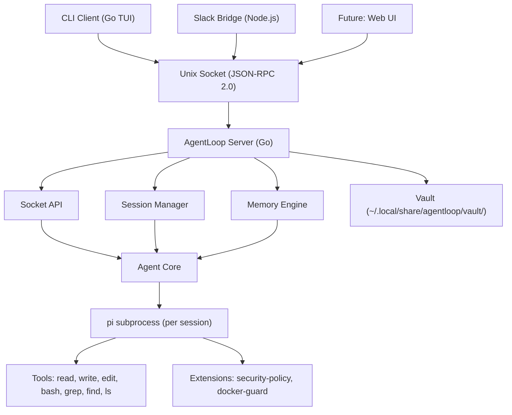

import { Aside } from '@astrojs/starlight/components';

## The Problem

**pi** (`@mariozechner/pi-coding-agent`) is a powerful coding agent with 15+ LLM providers and a rich set of tools (file read/write/edit, bash, grep, find, ls). But it runs as a single-shot subprocess with no memory, no safety gates, and no way for multiple clients to interact with it.

AgentLoop wraps pi and adds everything needed for production use.

## What pi Provides vs What AgentLoop Adds

| pi (Coding Agent) | AgentLoop (Orchestrator) |
|---|---|
| 15+ LLM providers (Anthropic, OpenAI, etc.) | Persistent memory (profiles, conversation history) |
| File read/write/edit tools | HITL safety gates for dangerous operations |
| Bash execution, grep, find, ls | Session management with concurrency limits |
| TypeScript extension system | Vault persistence (Obsidian-compatible) |
| JSON-RPC subprocess communication | Skills system (on-demand instruction injection) |
| | Multi-client support (CLI, Slack, future web UI) |
| | Prompt caching and context compaction |
| | Unix socket JSON-RPC server |

## System Architecture

## Two Binaries

- **`agentloop-server`** — Long-running Go server listening on a Unix socket. Manages sessions, memory, skills, HITL routing, and vault persistence.
- **`agentloop`** — Thin CLI client that connects to the server socket, sends tasks, and renders streamed output.

## Slack Bridge

The **AgentLoop Slack Bridge** is a separate companion project (Node.js/TypeScript) that translates Slack events into AgentLoop JSON-RPC calls and streams agent events back as Slack messages. It's a thin transport layer — all intelligence lives in the AgentLoop server.

<Aside type="tip">
  The Slack Bridge is developed in a separate repository (`agentloop-slack`). See the [Slack Bridge Overview](/slack-bridge/overview/) for details.
</Aside>
