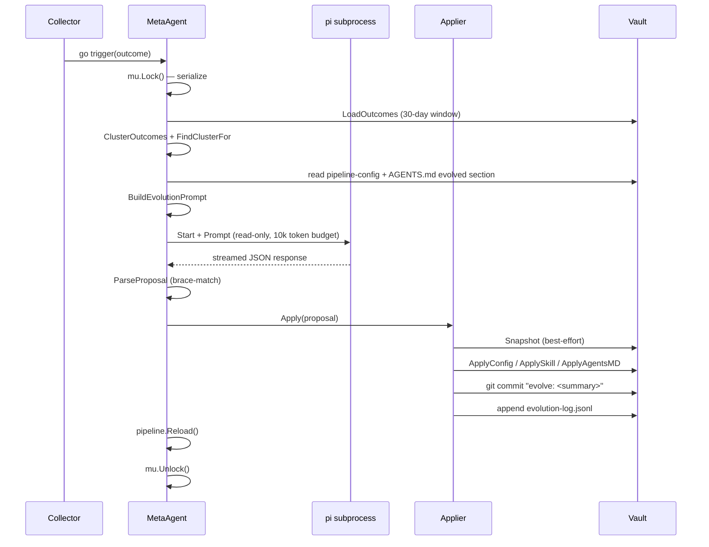

import { Aside } from '@astrojs/starlight/components';

## Overview

When the `Collector` triggers an evolution, `MetaAgent.Evolve()` runs in a background goroutine. It loads recent poor outcomes, clusters them by topic, builds an evolution prompt, runs a dedicated read-only pi session, parses the JSON proposal, and applies all changes via the Go `Applier` — without ever stopping the server. You see every change in `git log` and `evolution-log.jsonl`.

## End-to-End Lifecycle



## `MetaAgent.Evolve()` Step by Step

`Evolve(outcome TaskOutcome)` runs 10 steps serialized under a mutex:

1. **Acquire lock** — `m.mu.Lock()`. Concurrent triggers block here until the current run finishes.
2. **Load outcomes** — `metrics.LoadOutcomes(m.vaultPath, outcome.UserID, 30)`. Reads up to 30 days of JSONL for the user.
3. **Cluster** — `metrics.ClusterOutcomes(allOutcomes, m.evoCfg.MaxOutcomesPerRun)` then `FindClusterFor(clusters, outcome.SessionID)`. Falls back to `[]TaskOutcome{outcome}` if no cluster found.
4. **Read context** — Current `PipelineConfig` from the active pipeline; evolved AGENTS.md section via `readEvolvedSection()`.
5. **Build prompt** — `BuildEvolutionPrompt(EvolutionPrompt{...})` assembles the full markdown prompt.
6. **Run pi session** — `runPiSession(prompt)` starts a pi subprocess in a temp workdir, collects streamed text response, then stops pi.
7. **Parse proposal** — `ParseProposal(response)` extracts the outermost `{…}` JSON object using brace-matching.
8. **Apply** — `Applier.Apply(proposal)` writes all changes (snapshot → config → skills → AGENTS.md → git → log).
9. **Reload pipeline** — `m.pipeline.Reload()` atomic-swaps the new `PipelineConfig`.
10. **Release lock** — deferred `m.mu.Unlock()`.

## The Evolution Prompt

`BuildEvolutionPrompt()` assembles a markdown document with 6 sections. The meta-agent is instructed to respond with a single JSON object.

### `EvolutionPrompt` Struct

```go
type EvolutionPrompt struct {
    SystemContext string                  // meta-agent role + guidelines
    Outcomes      []metrics.TaskOutcome   // poor outcome cluster
    CurrentConfig *evolve.PipelineConfig  // current pipeline config (JSON)
    CurrentSkills []SkillSummary          // active skills (omitted if nil)
    AgentsMD      string                  // current EVOLVED section content
    Constraints   []string                // 5 hard rules
}
```

<Aside type="note">
`CurrentSkills` is currently always `nil` in `MetaAgent.Evolve()` — the "Active Skills" section of the prompt is only rendered when the slice is non-empty. This field is available for future use.
</Aside>

### System Context (Verbatim)

The system context sets the meta-agent's role. `DefaultSystemContext()` returns:

```
You are MemEvolve, a meta-evolution agent for the AgentLoop system.

Your job: analyze poor task outcomes and propose improvements to make future tasks succeed.

You can propose three types of changes:
1. **Pipeline config changes** — adjust retrieval parameters, compaction strategy, keyword limits, topic extensions
2. **Skill changes** — create or update skills (behavioral patterns) that will be loaded into future agent prompts
3. **AGENTS.md changes** — add learned patterns to the agent's core instructions

Guidelines:
- Focus on the specific topic cluster of failures. Don't make broad changes for narrow problems.
- Skills should have precise triggers so they only activate for relevant tasks.
- AGENTS.md changes should be concise bullet points, not lengthy instructions.
- Config changes should be conservative — small parameter tweaks, not radical rewrites.
- All skill names MUST be prefixed with "evolved-".
```

### The Five Constraints

These constraints are passed to every evolution prompt:

1. All skill names must be prefixed with `evolved-`
2. AGENTS.md changes are limited to the EVOLVED section
3. Config changes should be conservative — small tweaks, not rewrites
4. Maintain vault compatibility (Markdown/YAML format)
5. Position must remain `edges` for retriever (Lost in the Middle)

### Required Response Format

The prompt instructs the meta-agent to respond with a single JSON object:

```json
{
  "reasoning": "Why these changes will help",
  "config_changes": { "...pipeline config fields to change..." },
  "skill_changes": [
    {
      "action": "create|update|delete",
      "name": "evolved-NAME",
      "triggers": ["..."],
      "description": "...",
      "content": "..."
    }
  ],
  "agents_md_patch": "New content for the EVOLVED section (or empty)",
  "summary": "One-line summary for git commit"
}
```

## `EvolutionProposal` — The Go Types

`ParseProposal(text string)` extracts the outermost `{…}` from the pi response using brace-matching (ignores any surrounding prose), then JSON-unmarshals into:

```go
type EvolutionProposal struct {
    Reasoning     string
    ConfigChanges *PipelineConfig  // nil = no config changes
    SkillChanges  []SkillProposal
    AgentsMDPatch string           // empty = no AGENTS.md change
    Summary       string
}

type SkillProposal struct {
    Action      string   // "create", "update", or "delete"
    Name        string   // must start with "evolved-" — enforced by Applier
    Triggers    []string
    Description string
    Content     string   // full SKILL.md body
}
```

## The `Applier`

`Applier.Apply(proposal)` runs 6 steps in order. Steps 2–4 are non-fatal — failures are logged as warnings and execution continues:

### Step 1: Snapshot (best-effort)

```go
_, err := a.Snapshot()
if err != nil {
    slog.Warn("snapshot failed, continuing", "error", err)
}
```

Calls `version.Snapshotter.Take()` to create a timestamped copy in `vault/memory/evolved/snapshots/{YYYYMMDD-HHMMSS}/`. See [Versioning & Safety](/memevolve/versioning-and-safety) for snapshot contents.

### Step 2: `ApplyConfig()`

If `proposal.ConfigChanges != nil`, writes updated YAML to `vault/memory/evolved/pipeline-config.yaml`:

```go
func (a *Applier) ApplyConfig(cfg *evolve.PipelineConfig) error {
    dir := filepath.Join(a.vaultPath, "memory", "evolved")
    os.MkdirAll(dir, 0755)
    return evolve.SavePipelineConfig(filepath.Join(dir, "pipeline-config.yaml"), cfg)
}
```

### Step 3: `ApplySkill()`

Called once per `SkillProposal`. Enforces the `evolved-` prefix:

```go
func (a *Applier) ApplySkill(sp SkillProposal) error {
    if !strings.HasPrefix(sp.Name, "evolved-") {
        return fmt.Errorf("skill name must be prefixed with 'evolved-', got: %s", sp.Name)
    }
    // ...
}
```

Actions: `"create"` or `"update"` → write `SKILL.md` to `{skillsPath}/{sp.Name}/`. `"delete"` → `os.RemoveAll`.

### Step 4: `ApplyAgentsMD()`

Replaces the content between `<!-- EVOLVED:START -->` and `<!-- EVOLVED:END -->` markers. If markers are absent, the evolved block is appended to the file:

```go
startIdx := strings.Index(content, "<!-- EVOLVED:START -->")
endIdx   := strings.Index(content, "<!-- EVOLVED:END -->")

if startIdx == -1 || endIdx == -1 {
    // markers absent — append
    content = content + "\n" + evolvedBlock + "\n"
} else {
    // markers present — replace region
    content = content[:startIdx] + evolvedBlock + content[endIdx+len("<!-- EVOLVED:END -->"):]
}
```

<Aside type="danger">
Do not remove the `<!-- EVOLVED:START -->` and `<!-- EVOLVED:END -->` markers from `AGENTS.md`. Without them, every subsequent evolution **appends** a new block rather than merging in place — resulting in duplicate evolved sections.
</Aside>

### Step 5: `gitCommit()`

Lazy-initializes a git repo in the vault directory if one doesn't exist, stages all changes, and commits with prefix `"evolve: "`:

```go
msg := "evolve: " + summary
exec.Command("git", "commit", "-m", msg, "--allow-empty")
```

A `.gitignore` is written on init to exclude `memory/evolved/metrics/*.jsonl` and `memory/cache/` from commits.

### Step 6: `logEvolution()`

Appends a JSON line to `vault/memory/evolved/evolution-log.jsonl`:

```json
{"timestamp": "2026-03-18T14:23:01Z", "summary": "...", "reasoning": "..."}
```

## The Read-Only Pi Session

The meta-agent pi subprocess is started with no write/edit/bash tools. All file writes go through the Go `Applier` — the pi session only reads context and produces a JSON proposal.

The session runs in a temp directory (`os.MkdirTemp("", "memevolve-*")`), cleaned up after `<-b.Done()`. The token budget (`MetaTokenBudget: 10000`) is enforced via the pi config.

<Aside type="note">
The meta-agent session has no HITL handler. Evolution runs fully autonomously — there is no approval gate for proposed changes. Review changes via `git log` in the vault directory.
</Aside>
