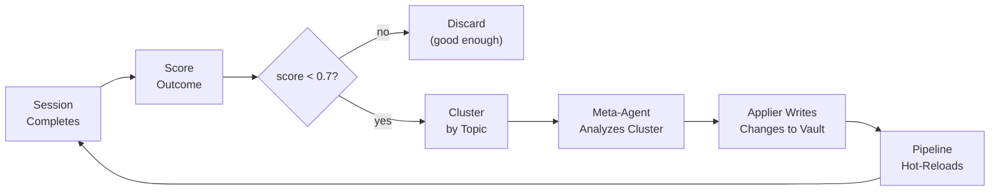

import { Aside } from '@astrojs/starlight/components';

## Overview

MemEvolve watches every completed session and scores its quality. When a session ends badly — too many human course-corrections, excessive tool calls, or outright errors — it analyzes what went wrong, proposes targeted improvements, and applies them automatically. Every change is snapshotted and git-committed so you can inspect, diff, or revert at any time.

<Aside type="tip">
MemEvolve is opt-in-by-default (`evolution.enabled: true`) but runs autonomously. You do not need to do anything to activate it. To disable it, set `evolution.enabled: false` in `agentloop.yaml`.
</Aside>

## The Four-Stage Feedback Loop

Each session completion feeds into a continuous improvement cycle:

The loop is **asynchronous** — it never blocks a session. It is **rate-limited** — a minimum cooldown and daily cap prevent runaway LLM costs. It is **serialized** — only one evolution runs at a time.

## What MemEvolve Can Change

All changes are scoped to the vault (`~/.local/share/agentloop/vault/`):

| Target | What changes | Where stored |
|--------|-------------|-------------|
| **Pipeline config** | Retrieval strategy, keyword limits, compaction, topic bonuses | `vault/memory/evolved/pipeline-config.yaml` |
| **Evolved skills** | New or updated `evolved-*` skills loaded into future prompts | `vault/skills/evolved-*/SKILL.md` |
| **Agent instructions** | Bullet points inside the `<!-- EVOLVED:START/END -->` markers in `AGENTS.md` | Agent's instruction file |

## What MemEvolve Cannot Change

These are hard boundaries enforced in code:

- Content in `AGENTS.md` **outside** the `<!-- EVOLVED:START -->` / `<!-- EVOLVED:END -->` markers
- Skills whose names do not start with `evolved-` (hand-authored skills are never touched)
- Security policies (`internal/security/`, TypeScript extensions)
- Core server configuration (`agentloop.yaml` fields outside `evolution:`)
- The `position: "edges"` retriever setting (always enforced, not overridable)

<Aside type="danger">
Do not remove the `<!-- EVOLVED:START -->` and `<!-- EVOLVED:END -->` markers from `AGENTS.md` manually. The Applier creates them on first evolution if absent — removing them causes subsequent patches to be appended to the file rather than merged in place.
</Aside>

## Key Guarantees

1. **Serialized** — `MetaAgent` holds a mutex for the full duration of each evolution. Concurrent triggers block and run sequentially.
2. **Rate-limited** — Minimum cooldown between runs (`min_cooldown_seconds: 300`) and a daily cap (`max_daily_runs: 10`). Both reset on server restart.
3. **Snapshot-before-apply** — A timestamped snapshot of the current config is attempted before any file is written (best-effort: a snapshot failure is logged but does not abort the evolution).
4. **Git-tracked** — Every evolution produces a `git commit` in the vault directory with message `evolve: 
`.
5. **Zero downtime** — Pipeline config is swapped atomically (`atomic.Pointer[Pipeline]`). In-flight sessions continue on the old pipeline; new sessions pick up the updated config immediately.
6. **Auditable** — Every run appends a line to `vault/memory/evolved/evolution-log.jsonl`.

<Aside type="tip">
See [Versioning & Safety](/memevolve/versioning-and-safety) for rollback procedures and the full audit trail structure.
</Aside>
