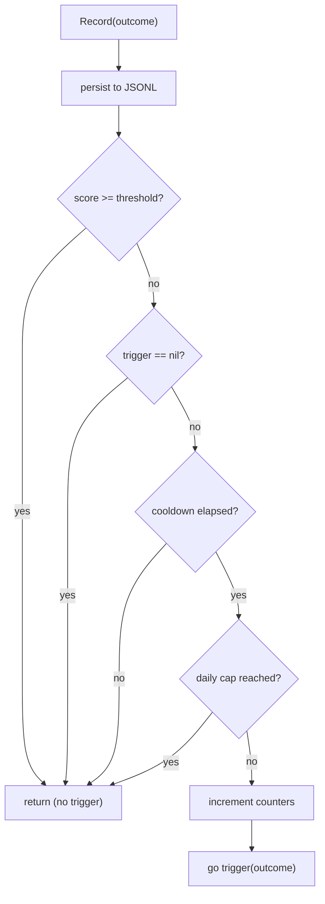

import { Aside } from '@astrojs/starlight/components';

## Overview

Every completed session produces a `TaskOutcome` with a composite score between `0.0` and `1.0`. Scores below the configured threshold (default `0.7`) may trigger an evolution run. The system groups related poor outcomes by topic before feeding them to the meta-agent — so the agent sees a coherent failure cluster, not a noisy global history.

## `TaskOutcome` — What Gets Recorded

One `TaskOutcome` is written per completed session. Fields are populated by the session manager at task completion:

```go
type TaskOutcome struct {
    SessionID     string        `json:"session_id"`
    UserID        string        `json:"user_id"`
    Timestamp     time.Time     `json:"timestamp"`
    HITLDenials   int           `json:"hitl_denials"`   // from sess.HITLDenialCount()
    HITLApprovals int           `json:"hitl_approvals"` // recorded but not currently populated (always 0)
    SteerCount    int           `json:"steer_count"`    // from sess.SteerCount()
    FinalStatus   string        `json:"final_status"`   // "done", "aborted", "error"
    TokensUsed    int           `json:"tokens_used"`
    ToolCalls     int           `json:"tool_calls"`
    Duration      time.Duration `json:"duration"`       // serialized as string e.g. "1m23s"
    TaskKeywords  []string      `json:"task_keywords"`  // ExtractKeywords(task text)
    TaskTopics    []string      `json:"task_topics"`    // ExtractTopics(task text)
    SkillsUsed    []string      `json:"skills_used"`
    PipelineID    string        `json:"pipeline_id"`    // config version at time of task
}
```

<Aside type="note">
`Duration` is JSON-serialized as a human-readable string (e.g. `"1m23.45s"`) via a custom `MarshalJSON`/`UnmarshalJSON` pair. Raw `time.Duration` integers do not appear in the JSONL file.
</Aside>

## The Scoring Formula

`Score()` is a pointer-receiver method. The baseline is a perfect task (`1.0`); only friction events reduce it:

```go
func (o *TaskOutcome) Score() float64 {
    score := 1.0
    score -= float64(o.HITLDenials) * 0.25  // human overrode the agent
    score -= float64(o.SteerCount) * 0.20   // human redirected mid-task
    if o.FinalStatus == "aborted" { score -= 0.3 }  // task abandoned
    if o.FinalStatus == "error"   { score -= 0.2 }  // unrecoverable failure
    if o.TokensUsed > 50000       { score -= 0.1 }  // inefficient context use
    if o.ToolCalls > 30           { score -= 0.1 }  // excessive tool use
    if score < 0.0 { return 0.0 }
    return math.Round(score*100) / 100  // rounded to 2 decimal places
}
```

**Score reference table:**

| Scenario | Score |
|----------|-------|
| Perfect task (no friction) | `1.00` |
| 1 HITL denial | `0.75` |
| 1 steer | `0.80` |
| 1 HITL denial + 1 steer | `0.55` |
| Aborted | `0.70` |
| Error | `0.80` |
| 4 denials | `0.00` (floor) |
| Aborted + 2 denials + 1 steer | `0.00` (floor) |

<Aside type="note">
There are no positive signals — the baseline is "worked perfectly". `HITLApprovals` are recorded but do not increase the score. Only friction (human intervention, failures, inefficiency) reduces it.
</Aside>

## Where Outcomes Are Stored

`Collector.persist()` appends each outcome as a JSON line to:

```
{vaultPath}/metrics/{userId}-YYYY-MM-DD.jsonl
```

Example JSONL line:
```json
{"session_id":"sess-a1b2c3d4","user_id":"marco","timestamp":"2026-03-18T14:23:01Z","hitl_denials":2,"hitl_approvals":0,"steer_count":1,"final_status":"done","tokens_used":32400,"tool_calls":12,"duration":"4m31.2s","task_keywords":["docker","build","pipeline"],"task_topics":["infrastructure","deployment"],"skills_used":[],"pipeline_id":"2"}
```

`LoadOutcomes(vaultPath, userId, maxDays)` reads the last `maxDays` files for a user and returns all outcomes as a slice.

## Outcome Clustering

Before the meta-agent analyzes outcomes, `ClusterOutcomes()` groups them by topic similarity using a connected-components algorithm:

**Connection criterion:**
- If both outcomes have `TaskTopics`: connected when they share ≥1 topic.
- If either has no topics: fallback — connected when they share ≥2 `TaskKeywords`.

**Why cluster?** A global list of poor outcomes is noisy and incoherent. Clustering ensures the meta-agent sees a focused set of related failures with a common topic thread, producing more targeted proposals.

**Example:**

```
Outcome A: topics=[infrastructure, deployment]
Outcome B: topics=[deployment, docker]
Outcome C: topics=[authentication, security]

Cluster 1: [A, B]   ← share "deployment"
Cluster 2: [C]      ← no shared topic with A or B
```

`FindClusterFor(clusters, sessionID)` returns the cluster containing the triggering session, or `nil` (falls back to `[]TaskOutcome{outcome}` in `MetaAgent.Evolve()`).

## The `Collector`

`Collector` is the gatekeeper between session completion and evolution trigger:

```go
type Collector struct {
    mu                 sync.Mutex
    vaultPath          string
    scoreThreshold     float64      // trigger if score < this
    minCooldownSeconds int          // minimum seconds between triggers
    maxDailyRuns       int          // maximum triggers per day
    lastTriggerTime    time.Time    // in-memory, resets on server restart
    dailyTriggerCount  int          // in-memory, resets daily
    dailyTriggerDate   string       // "YYYY-MM-DD" of last count reset
    trigger            EvolutionTriggerFunc
}
```

`Record(outcome)` flow:



<Aside type="note">
The trigger fires as a goroutine (`go trigger(outcome)`). If a second poor outcome arrives while an evolution is already running, that goroutine will block at the `MetaAgent` mutex and execute after the current evolution finishes. The rate limiter's cooldown effectively prevents queuing in normal operation.
</Aside>

## Rate Limiting

| Config field | Default | Effect |
|---|---|---|
| `evolution.score_threshold` | `0.7` | Outcomes with `score >= 0.7` never trigger |
| `evolution.min_cooldown_seconds` | `300` | 5-minute minimum between triggers |
| `evolution.max_daily_runs` | `10` | Hard cap per calendar day |

**All rate-limit state is in-memory.** It resets on server restart. There is no persistent rate-limit log.

<Aside type="caution">
Lowering `score_threshold` below `0.5` or `min_cooldown_seconds` below `60` will significantly increase LLM costs. Start conservative and adjust based on `evolution-log.jsonl` frequency.
</Aside>

## How the Session Manager Wires the Collector

At task completion, `session.Manager` calls `m.collector.Record(...)` with a `TaskOutcome` built from session counters:

```go
// session/manager.go — called at task completion
if m.collector != nil {
    m.collector.Record(metrics.TaskOutcome{
        SessionID:    sess.ID,
        UserID:       sess.UserID,
        Timestamp:    time.Now(),
        Duration:     time.Since(sess.StartedAt),
        TokensUsed:   result.Stats.Tokens,
        ToolCalls:    result.Stats.ToolCalls,
        HITLDenials:  sess.HITLDenialCount(),   // atomic counter on Session
        SteerCount:   sess.SteerCount(),         // atomic counter on Session
        // HITLApprovals not set — always defaults to 0 (field reserved for future use)
        FinalStatus:  string(sess.State),
        TaskKeywords: memory.ExtractKeywords(sess.Task),
        TaskTopics:   memory.ExtractTopics(sess.Task),
    })
}
```

Wire the collector via `session.Manager.SetMetricsCollector(collector)` during server initialization. If `SetMetricsCollector` is never called, `m.collector` remains `nil` and no outcomes are recorded.
