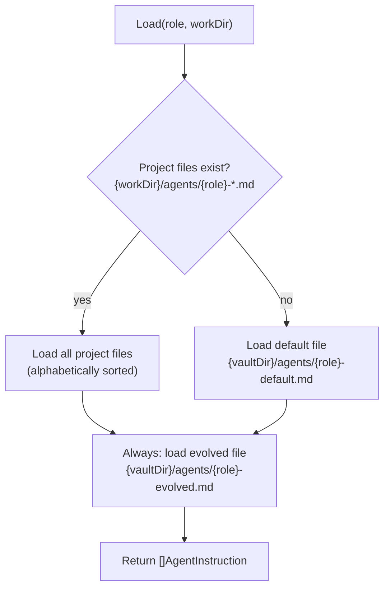

import { Aside } from '@astrojs/starlight/components';

## Overview

The Agent Loader (`AgentLoader`) discovers and loads Markdown instruction files for each Orchestrator role: **planner**, **worker**, and **judge**. Instructions customize how each agent behaves — what to prioritize, domain-specific rules, response formats, and quality standards. The loader supports a three-tier resolution chain: project files override defaults, and evolved files are always included.

## Resolution Chain

For each role, `Load(role, workDir)` resolves instructions in this order:



| Priority | Source | Path Pattern | When Used |
|----------|--------|-------------|-----------|
| 1 (highest) | Project | `{workDir}/agents/{role}-*.md` | If any matching files exist |
| 2 | Default | `{vaultDir}/agents/{role}-default.md` | Only if no project files found |
| 3 (always) | Evolved | `{vaultDir}/agents/{role}-evolved.md` | Always included (if file exists) |

<Aside type="note">
Project files take precedence over the default file, but the evolved file is always appended. This means project customizations and MemEvolve improvements coexist — you don't have to choose one or the other.
</Aside>

## Instruction File Format

Each instruction file uses Markdown with YAML frontmatter:

```markdown
---
name: planner-guidelines
role: planner
description: Planning guidelines for complex multi-step tasks
---

## Step Decomposition

When breaking a task into steps:
- Prefer parallelizable steps over sequential ones
- Each step should produce a testable result
- Keep step descriptions specific and actionable

## Dependency Rules

Only add dependencies when a step genuinely requires output from another step.
Unnecessary dependencies serialize execution and waste time.
```

### Frontmatter Fields

| Field | Type | Required | Description |
|-------|------|----------|-------------|
| `name` | `string` | Yes | Unique identifier for this instruction set |
| `role` | `string` | Yes | Must be `planner`, `worker`, or `judge` |
| `description` | `string` | Yes | Purpose of this instruction set |

## `AgentInstruction` Type

```go
type AgentInstruction struct {
    Name        string // e.g. "planner-guidelines"
    Role        string // "planner", "worker", or "judge"
    Description string // purpose
    Content     string // Markdown body (the actual instructions)
    Source      string // "project", "default", or "evolved"
}
```

The `Source` field tells you where the instruction came from — useful for debugging and understanding which instructions are active.

## File Structure Examples

### Project-Level Instructions

```
~/my-project/
└── agents/
    ├── planner-guidelines.md      ← source: "project"
    ├── planner-domain-rules.md    ← source: "project"
    ├── worker-code-standards.md   ← source: "project"
    └── judge-quality-bar.md       ← source: "project"
```

### Vault-Level Defaults and Evolved

```
~/.local/share/agentloop/vault/
└── agents/
    ├── planner-default.md         ← source: "default"
    ├── worker-default.md          ← source: "default"
    ├── judge-default.md           ← source: "default"
    ├── planner-evolved.md         ← source: "evolved" (written by MemEvolve)
    ├── worker-evolved.md          ← source: "evolved"
    └── judge-evolved.md           ← source: "evolved"
```

<Aside type="tip">
Evolved files are managed by [MemEvolve](/memevolve/overview/). When the meta-agent proposes agent instruction improvements, the [Applier](/memevolve/evolution-loop/#step-3-applyskill) writes them to `{role}-evolved.md`. You should not edit evolved files manually — they will be overwritten on the next evolution.
</Aside>

## How Instructions Reach the Agents

The loaded instructions are injected into each agent's prompt by the respective prompt builder:

```
buildPlannerPrompt():
  Planner Instructions (from AgentLoader)  ← first in prompt
  + Memory Context
  + Task
  + Output Schema

buildWorkerPrompt():
  Worker Instructions (from AgentLoader)
  + Memory Context
  + Step Description + Hint

buildJudgePrompt():
  Judge Instructions (from AgentLoader)
  + Task + Criteria
  + Worker Summaries
  + Output Schema
```

Instructions appear first in the prompt to take advantage of Anthropic prompt caching — they change infrequently and form a stable prefix.

## Default Instructions

AgentLoop ships with default instructions for each role at `{vaultDir}/agents/`:

| File | Purpose |
|------|---------|
| `planner-default.md` | Step decomposition, dependency rules, mode assessment criteria |
| `worker-default.md` | Tool usage patterns, output structure, error handling |
| `judge-default.md` | Evaluation methodology, gap identification, evidence requirements |

See [Tutorial: Custom Agent Instructions](/orchestrator/custom-agents/) for how to write your own.
