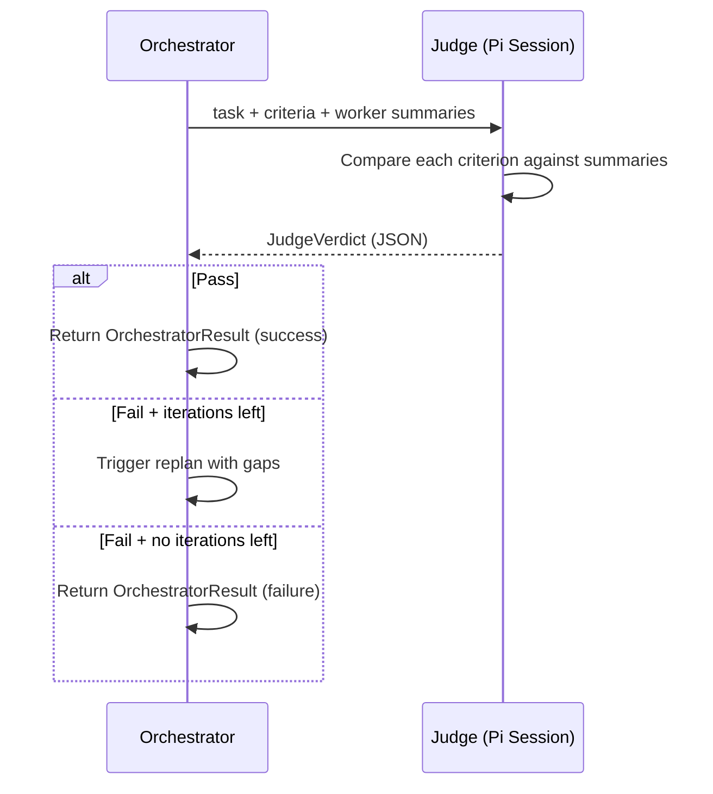
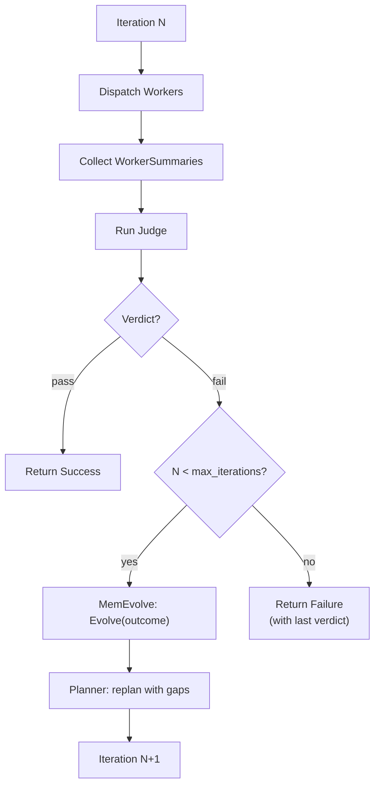

import { Aside } from '@astrojs/starlight/components';

## Overview

The Judge is called after all workers in an iteration complete. It receives the original task, the plan's success criteria, and all worker summaries, then produces a structured verdict: **pass** (all criteria met) or **fail** (with specific gaps). A failing verdict triggers replanning if iterations remain.

## JudgeVerdict

```go
type JudgeVerdict struct {
    Pass           bool       // did workers meet all criteria?
    Reasoning      string     // judge's explanation
    Gaps           []JudgeGap // what's missing or wrong
    GapSpecificity int        // 0-10 score on how specific gaps are
    Iteration      int        // which iteration produced this
}

type JudgeGap struct {
    CriterionID  string // which success criterion was missed
    Description  string // what's wrong
    Evidence     string // proof from worker output
    SuggestedFix string // how to fix it
}
```

<Aside type="note">
`GapSpecificity` helps the Orchestrator assess whether the Judge produced actionable feedback. A score of 0 means vague feedback ("something is wrong"), while 10 means highly specific ("step-2 failed to validate email format — the regex is missing the `+` character").
</Aside>

## Evaluation Flow



## Judge Prompt

`buildJudgePrompt()` assembles the evaluation context:

```
┌────────────────────────────────────┐
│ Judge Instructions                 │  ← From AgentLoader
│ (project + default + evolved)      │
├────────────────────────────────────┤
│ Original Task                      │  ← User's request
├────────────────────────────────────┤
│ Success Criteria                   │  ← From Plan
│ 1. ...                             │
│ 2. ...                             │
├────────────────────────────────────┤
│ Worker Summaries                   │  ← Capped to SummaryMaxTokens each
│ [step-1]: done — "..."             │
│ [step-2]: done — "..."             │
│   Tools used: [read, write, bash]  │
├────────────────────────────────────┤
│ Iteration: N of max_iterations     │
├────────────────────────────────────┤
│ Respond with JSON: {pass, gaps,    │  ← Output schema
│   reasoning, gap_specificity}      │
└────────────────────────────────────┘
```

The Judge uses `claude-opus-4-6` by default (configurable via `orchestrator.judge`) because nuanced evaluation of worker output requires strong reasoning.

## Pass/Fail Decision

The Judge evaluates each success criterion against the collected worker summaries:

| Scenario | Verdict |
|----------|---------|
| All criteria met with evidence | `Pass: true`, empty `Gaps` |
| Some criteria met, some missing | `Pass: false`, gaps for missing criteria |
| Workers failed or produced errors | `Pass: false`, gaps describing failures |
| Workers partially completed | `Pass: false`, gaps for incomplete work |

## How Gaps Drive Iteration

When the Judge returns `Pass: false`, each `JudgeGap` provides actionable feedback:

```json
{
  "pass": false,
  "reasoning": "Step 2 implemented the endpoint but didn't add input validation",
  "gaps": [
    {
      "criterion_id": "criteria-3",
      "description": "Missing email format validation on POST /users",
      "evidence": "Worker summary shows route handler but no validation middleware",
      "suggested_fix": "Add email regex validation in the request handler before DB insert"
    }
  ],
  "gap_specificity": 8
}
```

This verdict is passed to the [Planner](/orchestrator/planner/) during replanning. The Planner uses the gaps to produce a targeted plan that addresses only the missing criteria — it doesn't redo work that already passed.

<Aside type="tip">
High `GapSpecificity` scores (7+) tend to produce better replans because the Planner gets precise instructions about what to fix. If you see consistently low specificity, consider customizing the Judge's instructions. See [Tutorial: Custom Agent Instructions](/orchestrator/custom-agents/).
</Aside>

## Judge Pi Session

Like the [Planner](/orchestrator/planner/#planner-pi-session), the Judge runs as a read-only pi session. It cannot write files or execute tools — it only evaluates worker output and produces a JSON verdict. This isolation ensures the Judge's evaluation is objective and doesn't introduce side effects.

## Iteration Lifecycle

The full iteration loop with Judge involvement:



<Aside type="note">
The MemEvolve step between Judge failure and replanning is optional — it only runs if `evolution.enabled: true`. When it runs, it may improve the planner/worker/judge instructions before the next iteration, creating a real-time learning loop. See [MemEvolve Integration](/orchestrator/overview/#memevolve-integration).
</Aside>
