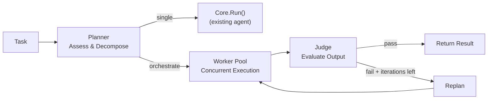

import { Aside } from '@astrojs/starlight/components';

## Overview

The Orchestrator sits between the [Session Manager](/architecture/session-lifecycle/) and the [Agent Core](/architecture/agent-core/). When a task arrives, the Orchestrator asks a **Planner** agent whether the task is simple enough for a single agent or complex enough to warrant multi-agent coordination. Simple tasks go straight to `Core.Run()`. Complex tasks enter a **Planner → Worker → Judge** loop that decomposes, executes, and evaluates work iteratively.

<Aside type="note">
The Orchestrator is part of the AgentLoop server (`internal/agent/`). It does not require a separate binary or service — it runs inside the same process as the rest of the server.
</Aside>

## The Planner-Worker-Judge Loop



The Planner decides the execution mode dynamically — the same Orchestrator handles both paths. When the Judge fails a result, the Planner receives the verdict and gap details so it can adjust the plan for the next iteration.

## Key Components

| Component | Responsibility | Model |
|-----------|---------------|-------|
| **[Planner](/orchestrator/planner/)** | Assess task complexity, decompose into steps with dependencies | `claude-opus-4-6` |
| **[Worker Pool](/orchestrator/worker-pool/)** | Execute plan steps concurrently with topological ordering | `claude-sonnet-4-6` |
| **[Judge](/orchestrator/judge/)** | Evaluate worker output against success criteria, identify gaps | `claude-opus-4-6` |
| **[Agent Loader](/orchestrator/agent-loader/)** | Discover and load role-specific instructions (project → default → evolved) | — |

## What the Orchestrator Produces

Every orchestration run returns an `OrchestratorResult`:

```go
type OrchestratorResult struct {
    OrchestrationID string           // unique run identifier
    Mode            string           // "single" or "orchestrated"
    Plan            *Plan            // assessed plan (nil for single mode)
    Iterations      []IterationResult // per-iteration worker summaries + verdicts
    FinalVerdict    *JudgeVerdict    // final pass/fail (nil for single mode)
    TotalTokens     int
    TotalDuration   time.Duration
}
```

## MemEvolve Integration

Orchestration outcomes feed directly into the [MemEvolve](/memevolve/overview/) feedback loop. After each orchestration, an `OrchestratorOutcome` is converted to a `TaskOutcome` and recorded via the `metrics.Collector`. This means:

- Failed orchestrations (judge verdict: fail) lower the score and can trigger evolution
- Mid-loop evolution is possible — if the Judge fails an iteration, `MetaAgent.Evolve()` runs before the next replan, improving planner/worker/judge instructions in real time
- Evolved agent instructions are written to `{vaultDir}/agents/{role}-evolved.md`

<Aside type="tip">
See [Configuration](/orchestrator/configuration/) for the full `orchestrator:` YAML reference and tuning guide.
</Aside>

## Key Guarantees

1. **Backward compatible** — Tasks that don't need orchestration go through `Core.Run()` unchanged. The Planner's "single" mode is the default for simple tasks.
2. **Bounded iterations** — `max_iterations` (default: 3) caps the replan loop. The Orchestrator never runs forever.
3. **Dependency-aware concurrency** — Workers respect step dependencies via topological sort. Steps without dependencies run in parallel; dependent steps wait.
4. **Summary capping** — Worker output is truncated to `summary_max_tokens` (default: 1500) before reaching the Judge, keeping context manageable.
5. **HITL transparent** — All HITL requests from workers pass through to the session callbacks. Slack and CLI users see approval prompts as normal.
6. **Observable** — Every orchestration produces structured results with per-iteration history, token counts, and timing.
