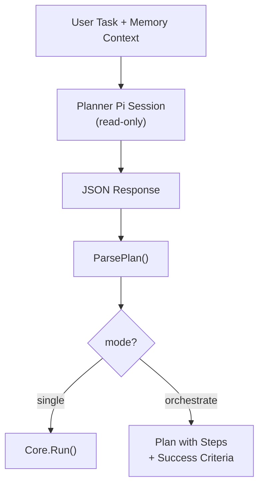
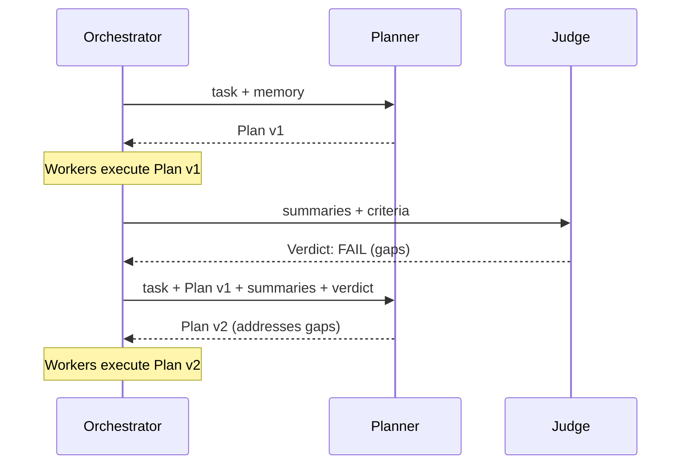

import { Aside } from '@astrojs/starlight/components';

## Overview

The Planner is the first agent invoked in the orchestration loop. It receives the user's task (plus memory context) and decides: should this be handled by a single agent, or does it need multi-agent coordination? If orchestration is needed, it produces a structured plan with steps, dependencies, and success criteria.

## The Plan

```go
type Plan struct {
    Mode            string      // "single" or "orchestrate"
    Steps           []PlanStep  // execution units (empty for "single" mode)
    SuccessCriteria []string    // what constitutes success
    Reasoning       string      // why this plan
}

type PlanStep struct {
    ID           string   // unique step identifier (e.g. "step-1")
    Description  string   // what to do
    Dependencies []string // step IDs this depends on
    WorkerHint   string   // guidance for the worker agent
}
```

<Aside type="note">
`Dependencies` enables topological ordering. A step with `Dependencies: ["step-1", "step-2"]` will not execute until both `step-1` and `step-2` have completed. Steps with no dependencies run in the first layer.
</Aside>

## Mode Assessment

The Planner prompt includes:

1. **Planner instructions** — loaded by the [Agent Loader](/orchestrator/agent-loader/) (project → default → evolved)
2. **Memory context** — user profile and relevant conversation history
3. **The task** — the user's original request

The Planner responds with a JSON object. The Orchestrator parses it into a `Plan`:



### When the Planner Chooses "single"

Simple, self-contained tasks that don't benefit from decomposition:

- "List files in the current directory"
- "Fix the typo in README.md"
- "What does this function do?"

### When the Planner Chooses "orchestrate"

Tasks that benefit from parallel work, sequential dependencies, or quality evaluation:

- "Refactor the authentication module and update all tests"
- "Build a REST API with 4 endpoints, validation, and documentation"
- "Migrate the database schema and update all affected queries"

## Replanning on Failure

When the [Judge](/orchestrator/judge/) returns a failing verdict, the Planner is called again with additional context:

```
Original Task
+ Previous Plan
+ Worker Summaries (what was actually produced)
+ Judge Verdict (what failed and why)
+ Judge Gaps (specific missing criteria with evidence)
```

The Planner reassesses and produces a new plan that addresses the identified gaps. This enables iterative refinement — each iteration builds on what workers already accomplished.



<Aside type="caution">
Replanning is bounded by `max_iterations` (default: 3). After the final iteration, the Orchestrator returns whatever the Judge's last verdict was — pass or fail.
</Aside>

## Planner Pi Session

The Planner runs as a **read-only pi session** via `runReadOnlyPi()`. It cannot write files, execute bash, or use tools — it only reads context and produces a JSON plan. This is the same isolation model used by the [MemEvolve meta-agent](/memevolve/evolution-loop/#the-read-only-pi-session).

The Planner uses `claude-opus-4-6` by default (configurable via `orchestrator.planner` in `agentloop.yaml`) because plan assessment requires strong reasoning capabilities.

## Prompt Assembly

`buildPlannerPrompt()` assembles the planner prompt:

```
┌────────────────────────────────────┐
│ Planner Instructions               │  ← From AgentLoader
│ (project + default + evolved)      │
├────────────────────────────────────┤
│ <memory>                           │  ← User profile + history
│   User context...                  │
│ </memory>                          │
├────────────────────────────────────┤
│ Task: "..."                        │  ← User's original request
├────────────────────────────────────┤
│ [Previous verdict + gaps]          │  ← Only on replan
├────────────────────────────────────┤
│ Respond with JSON: {mode, steps,   │  ← Output schema
│   success_criteria, reasoning}     │
└────────────────────────────────────┘
```
