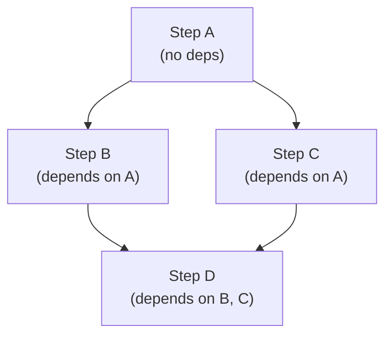
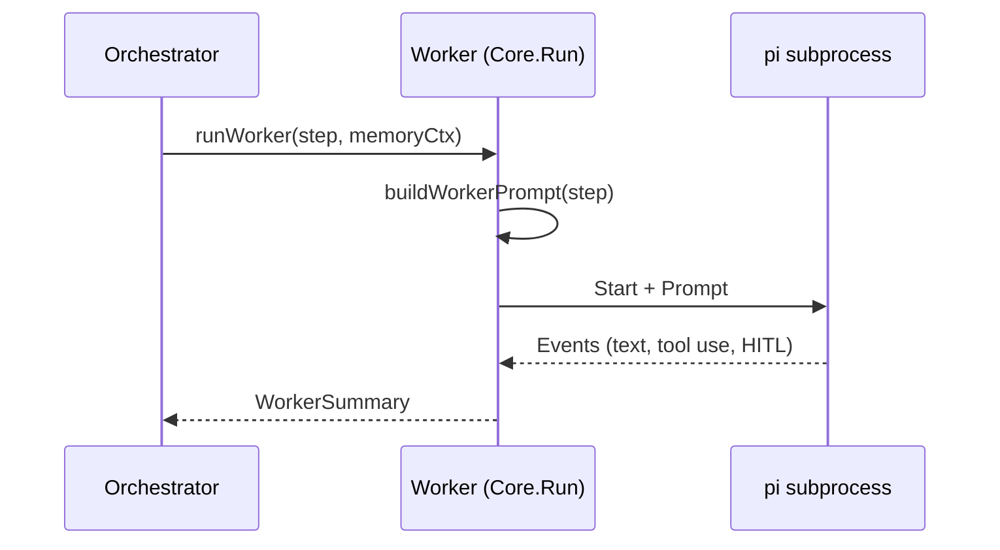

import { Aside } from '@astrojs/starlight/components';

## Overview

The Worker Pool takes a [Plan](/orchestrator/planner/) and executes its steps concurrently while respecting dependencies. Each worker is a full [Agent Core](/architecture/agent-core/) session — it has access to all tools (read, write, edit, bash, grep) and runs through the normal HITL gates. Workers produce summaries that are passed to the [Judge](/orchestrator/judge/) for evaluation.

## Topological Sort

`TopoSort()` implements Kahn's algorithm to group plan steps into dependency layers:

```go
func TopoSort(steps []PlanStep) ([][]PlanStep, error)
```

Steps with no dependencies form the first layer. Each subsequent layer contains steps whose dependencies are all in previous layers:

```
Steps: [A(deps=[]), B(deps=[A]), C(deps=[A]), D(deps=[B,C])]

Layer 1: [A]        ← no dependencies, runs first
Layer 2: [B, C]     ← both depend on A, run in parallel
Layer 3: [D]        ← depends on B and C, runs last
```



<Aside type="note">
`TopoSort()` returns an error if the dependency graph contains a cycle. The Orchestrator treats this as a planning failure and falls back to single-agent mode.
</Aside>

## Concurrent Execution

The Orchestrator dispatches each layer sequentially. Within a layer, steps run concurrently using a bounded goroutine pool:

```go
type WorkerPool struct {
    Size    int           // max concurrent workers (default: 4)
    Timeout time.Duration // per-worker timeout
}
```

**Execution model:**
1. For each layer in topological order:
   - Launch all steps in the layer as goroutines (bounded by `WorkerPoolSize`)
   - Wait for all steps in the layer to complete
2. Move to the next layer
3. Collect all `WorkerSummary` results

The semaphore ensures at most `WorkerPoolSize` goroutines run simultaneously, even if a layer has more steps than the pool size.

## Worker Execution

Each worker runs via `runWorker()`, which delegates to `Core.Run()`:



The worker prompt includes:

- **Worker instructions** — loaded by the [Agent Loader](/orchestrator/agent-loader/)
- **Memory context** — same user context as the parent session
- **Step description** — from `PlanStep.Description`
- **Worker hint** — from `PlanStep.WorkerHint` (planner guidance)

Workers use `claude-sonnet-4-6` by default — a cost-effective model for execution tasks (configurable via `orchestrator.worker`).

## WorkerSummary

Each worker produces a summary of what it accomplished:

```go
type WorkerSummary struct {
    StepID        string        // which step executed
    Status        string        // "done", "failed", or "partial"
    Summary       string        // truncated output
    ToolsUsed     []string      // tools called during execution
    HITLDenials   int           // HITL blocks encountered
    HITLApprovals int           // HITL approvals received
    TokensUsed    int           // estimated tokens consumed
    Duration      time.Duration
}
```

### Summary Capping

Worker output is truncated to `SummaryMaxTokens` (default: 1500 tokens ≈ 6000 characters) before being passed to the Judge. This prevents long worker outputs from consuming the Judge's context window:

```go
func TruncateSummary(text string, maxTokens int) string
```

<Aside type="caution">
If a worker produces important output near the end of a long response, summary capping may truncate it. The Judge only sees the first ~6000 characters. Consider this when writing [custom worker instructions](/orchestrator/custom-agents/) — instruct workers to put key results at the beginning of their responses.
</Aside>

## HITL Transparency

Workers run through the full [HITL flow](/architecture/hitl-flow/). When a worker triggers a dangerous tool (e.g. `bash`, `docker`, `git push`), the HITL request flows through to the session callbacks:

```
Worker → Core → HITL Gate → Session → Client (CLI/Slack)
```

The user sees the same approval prompt they would see in a single-agent session. HITL denials and approvals are tracked per-worker in the `WorkerSummary` and aggregated in the `OrchestratorOutcome`.

## Error Handling

| Scenario | Behavior |
|----------|----------|
| Worker completes successfully | `Status: "done"`, summary collected |
| Worker encounters an error | `Status: "failed"`, error in summary |
| Worker times out | `Status: "failed"`, timeout noted |
| Worker partially completes | `Status: "partial"`, partial output in summary |
| All workers in a layer fail | Layer still completes; Judge evaluates gaps |
