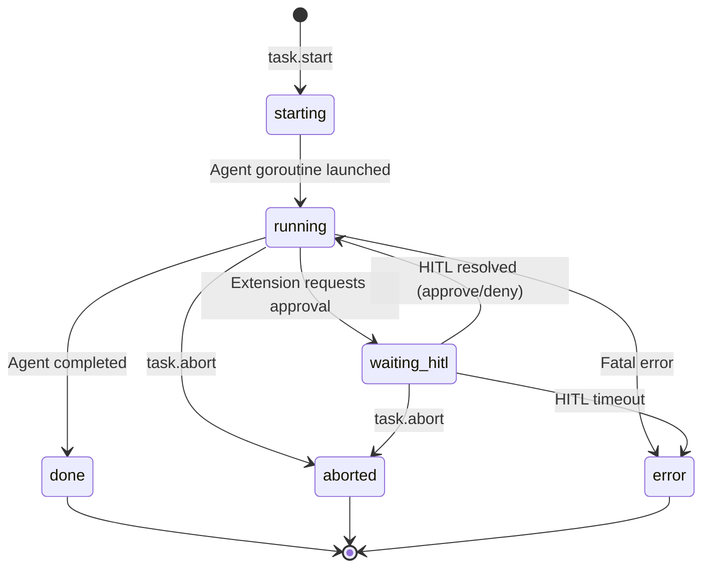

## State Diagram



## States

| State | Value | Meaning | Entry Trigger | Exit Trigger |
|-------|-------|---------|---------------|--------------|
| Starting | `starting` | Session created, agent initializing | `task.start` received | Agent core begins |
| Running | `running` | Agent actively processing task | Agent started; HITL resolved | Done, abort, error, or HITL request |
| Waiting HITL | `waiting_hitl` | Blocked on human approval | Pi extension requests confirmation | User responds; timeout |
| Done | `done` | Task completed successfully | Agent returns result | Terminal |
| Aborted | `aborted` | User cancelled the task | `task.abort` received | Terminal |
| Error | `error` | Task failed | Unrecoverable error | Terminal |

## Go Type Definition

```go
type State string

const (
    StateStarting    State = "starting"
    StateRunning     State = "running"
    StateWaitingHITL State = "waiting_hitl"
    StateDone        State = "done"
    StateAborted     State = "aborted"
    StateError       State = "error"
)
```

## SessionInfo Response Schema

Returned by `session.list`:

```go
type SessionInfo struct {
    ID     string `json:"id"`      // "sess-a1b2c3d4"
    UserID string `json:"userId"`
    Task   string `json:"task"`
    State  State  `json:"state"`   // One of the states above
    Source string `json:"source"`  // "cli", "slack", etc.
    Start  string `json:"start"`   // RFC3339 timestamp
}
```

**Example response:**

```json
[
  {
    "id": "sess-a1b2c3d4",
    "userId": "marco",
    "task": "fix failing tests in user.go",
    "state": "running",
    "source": "cli",
    "start": "2026-02-27T14:00:00Z"
  }
]
```

## Session ID Format

`sess-<uuid[:8]>`

Example: `sess-a1b2c3d4`

Generated using the first 8 characters of a UUID v4.
