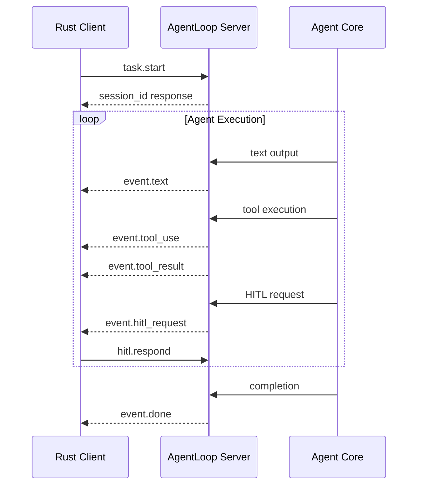

import { Aside, Code, Tabs, TabItem } from '@astrojs/starlight/components';

## Event System Overview

The AgentLoop Rust client provides real-time event streaming from the server using async channels. Events are delivered as soon as they occur, allowing for responsive user interfaces and real-time progress monitoring.



## Event Types

### Text Events

Streaming text output from the agent:

```rust
AgentEvent::Text { 
    session_id: String,
    content: String 
}
```

**Usage:**
```rust
AgentEvent::Text { session_id, content } => {
    // Stream to UI, append to buffer, etc.
    print!("{}", content);
    text_buffer.push_str(&content);
}
```

### Tool Events

Tool execution start and completion:

```rust
// Tool starts executing
AgentEvent::ToolUse {
    session_id: String,
    tool_name: String,
    input: serde_json::Value,
}

// Tool execution completes
AgentEvent::ToolResult {
    session_id: String,
    tool_name: String,
    output: String,
    success: bool,
}
```

**Usage:**
```rust
AgentEvent::ToolUse { tool_name, input, .. } => {
    println!("🔧 Using {}: {}", tool_name, input);
    show_progress_indicator(&tool_name);
}

AgentEvent::ToolResult { tool_name, output, success, .. } => {
    hide_progress_indicator();
    if success {
        println!("✅ {} completed", tool_name);
        log_tool_output(&tool_name, &output);
    } else {
        println!("❌ {} failed: {}", tool_name, output);
        handle_tool_error(&tool_name, &output);
    }
}
```

### HITL Events

Human-in-the-loop approval requests:

```rust
AgentEvent::HITLRequest {
    session_id: String,
    request_id: String,
    tool_name: String,
    details: String,
    options: Vec<String>,
}
```

**Usage:**
```rust
AgentEvent::HITLRequest { session_id, request_id, tool_name, details, options, .. } => {
    println!("❓ Approval needed for {}: {}", tool_name, details);
    println!("Options: {}", options.join(", "));
    
    // Show approval dialog to user
    let decision = show_approval_dialog(&details, &options).await?;
    
    // Send response back to server
    client.respond_hitl(&session_id, &request_id, decision).await?;
}
```

### Completion Events

Task completion (success or error):

```rust
// Successful completion
AgentEvent::Done {
    session_id: String,
    output: String,
    stats: TaskStats,
}

// Error or failure
AgentEvent::Error {
    session_id: String,
    message: String,
}

// Session saved to vault
AgentEvent::SessionSaved {
    session_id: String,
}
```

**Usage:**
```rust
AgentEvent::Done { output, stats, .. } => {
    println!("✅ Task completed!");
    println!("Final output: {}", output);
    println!("Stats: {} tools, {} HITL requests, {}ms", 
             stats.tool_calls, stats.hitl_requests, stats.duration_ms);
    break; // Exit event loop
}

AgentEvent::Error { message, .. } => {
    eprintln!("❌ Task failed: {}", message);
    handle_error(&message);
    break; // Exit event loop
}
```

## Event Processing Patterns

### Basic Event Loop

The simplest way to handle events:

```rust
use agentloop_bridge::{AgentLoopClient, ClientConfig, AgentEvent};

#[tokio::main]
async fn main() -> Result<(), Box<dyn std::error::Error>> {
    let mut client = AgentLoopClient::new(ClientConfig::default());
    client.connect().await?;
    
    let session_id = client.start_task("user", "task", None, "example").await?;
    
    // Take event receiver (can only be done once)
    let mut event_rx = client.take_event_receiver().unwrap();
    
    // Process events until completion
    while let Some(event) = event_rx.recv().await {
        match event {
            AgentEvent::Text { content, .. } => print!("{}", content),
            AgentEvent::Done { .. } => break,
            AgentEvent::Error { message, .. } => {
                eprintln!("Error: {}", message);
                break;
            }
            _ => {} // Handle other events as needed
        }
    }
    
    Ok(())
}
```

### Multi-Session Handling

Handle multiple sessions concurrently:

```rust
use std::collections::HashMap;
use tokio::sync::mpsc;

struct SessionManager {
    client: AgentLoopClient,
    active_sessions: HashMap<String, SessionState>,
}

struct SessionState {
    output_buffer: String,
    tool_count: u32,
    hitl_count: u32,
}

impl SessionManager {
    async fn start_session(&mut self, user_id: &str, task: &str) -> Result<String> {
        let session_id = self.client.start_task(user_id, task, None, "manager").await?;
        
        self.active_sessions.insert(session_id.clone(), SessionState {
            output_buffer: String::new(),
            tool_count: 0,
            hitl_count: 0,
        });
        
        Ok(session_id)
    }
    
    async fn process_events(&mut self) -> Result<()> {
        let mut event_rx = self.client.take_event_receiver().unwrap();
        
        while let Some(event) = event_rx.recv().await {
            match event {
                AgentEvent::Text { session_id, content } => {
                    if let Some(state) = self.active_sessions.get_mut(&session_id) {
                        state.output_buffer.push_str(&content);
                        self.update_ui(&session_id, &content).await;
                    }
                }
                
                AgentEvent::ToolUse { session_id, .. } => {
                    if let Some(state) = self.active_sessions.get_mut(&session_id) {
                        state.tool_count += 1;
                    }
                }
                
                AgentEvent::HITLRequest { session_id, request_id, details, .. } => {
                    if self.active_sessions.contains_key(&session_id) {
                        let decision = self.handle_approval(&session_id, &details).await?;
                        self.client.respond_hitl(&session_id, &request_id, decision).await?;
                    }
                }
                
                AgentEvent::Done { session_id, .. } | 
                AgentEvent::Error { session_id, .. } => {
                    self.active_sessions.remove(&session_id);
                    if self.active_sessions.is_empty() {
                        break; // All sessions completed
                    }
                }
                
                _ => {}
            }
        }
        
        Ok(())
    }
}
```

### Buffered Text Output

Buffer and flush text efficiently:

```rust
use std::time::{Duration, Instant};

struct BufferedOutput {
    buffer: String,
    last_flush: Instant,
    flush_interval: Duration,
}

impl BufferedOutput {
    fn new() -> Self {
        Self {
            buffer: String::new(),
            last_flush: Instant::now(),
            flush_interval: Duration::from_millis(100), // Flush every 100ms
        }
    }
    
    async fn add_text(&mut self, text: &str) -> Result<()> {
        self.buffer.push_str(text);
        
        // Flush if buffer is large or enough time has passed
        if self.buffer.len() > 1000 || self.last_flush.elapsed() > self.flush_interval {
            self.flush().await?;
        }
        
        Ok(())
    }
    
    async fn flush(&mut self) -> Result<()> {
        if !self.buffer.is_empty() {
            // Send to UI, write to file, etc.
            self.write_to_output(&self.buffer).await?;
            self.buffer.clear();
            self.last_flush = Instant::now();
        }
        Ok(())
    }
    
    async fn write_to_output(&self, text: &str) -> Result<()> {
        // Implementation depends on your UI framework
        println!("{}", text);
        Ok(())
    }
}

// Usage in event loop
let mut output = BufferedOutput::new();

while let Some(event) = event_rx.recv().await {
    match event {
        AgentEvent::Text { content, .. } => {
            output.add_text(&content).await?;
        }
        AgentEvent::Done { .. } => {
            output.flush().await?; // Ensure all text is flushed
            break;
        }
        _ => {}
    }
}
```

### Error Recovery

Handle connection issues and retry logic:

```rust
use backoff::{ExponentialBackoff, backoff::Backoff};

struct ResilientEventHandler {
    client: AgentLoopClient,
    config: ClientConfig,
    backoff: ExponentialBackoff,
}

impl ResilientEventHandler {
    async fn process_with_retry(&mut self) -> Result<()> {
        loop {
            match self.process_events().await {
                Ok(()) => break, // Success
                Err(e) => {
                    eprintln!("Event processing failed: {}", e);
                    
                    if let Some(delay) = self.backoff.next_backoff() {
                        eprintln!("Retrying in {:?}", delay);
                        tokio::time::sleep(delay).await;
                        
                        // Reconnect and retry
                        self.client = AgentLoopClient::new(self.config.clone());
                        self.client.connect().await?;
                    } else {
                        return Err(e); // Max retries exceeded
                    }
                }
            }
        }
        Ok(())
    }
}
```

## Advanced Patterns

### Event Filtering

Process only specific events or sessions:

```rust
struct EventFilter {
    target_session: Option<String>,
    event_types: HashSet<String>,
}

impl EventFilter {
    fn should_process(&self, event: &AgentEvent) -> bool {
        // Filter by session ID
        let session_matches = if let Some(ref target) = self.target_session {
            match event {
                AgentEvent::Text { session_id, .. } |
                AgentEvent::ToolUse { session_id, .. } |
                AgentEvent::Done { session_id, .. } => session_id == target,
                _ => false,
            }
        } else {
            true // Process all sessions
        };
        
        // Filter by event type
        let event_type = match event {
            AgentEvent::Text { .. } => "text",
            AgentEvent::ToolUse { .. } => "tool_use",
            AgentEvent::HITLRequest { .. } => "hitl",
            AgentEvent::Done { .. } => "done",
            AgentEvent::Error { .. } => "error",
            _ => "other",
        };
        
        let type_matches = self.event_types.is_empty() || 
                          self.event_types.contains(event_type);
        
        session_matches && type_matches
    }
}
```

### Event Metrics

Collect statistics on event processing:

```rust
#[derive(Debug, Default)]
struct EventMetrics {
    text_events: u64,
    tool_events: u64,
    hitl_events: u64,
    completion_events: u64,
    error_events: u64,
    total_text_chars: u64,
    processing_times: Vec<Duration>,
}

impl EventMetrics {
    fn record_event(&mut self, event: &AgentEvent, processing_time: Duration) {
        self.processing_times.push(processing_time);
        
        match event {
            AgentEvent::Text { content, .. } => {
                self.text_events += 1;
                self.total_text_chars += content.len() as u64;
            }
            AgentEvent::ToolUse { .. } | AgentEvent::ToolResult { .. } => {
                self.tool_events += 1;
            }
            AgentEvent::HITLRequest { .. } => {
                self.hitl_events += 1;
            }
            AgentEvent::Done { .. } => {
                self.completion_events += 1;
            }
            AgentEvent::Error { .. } => {
                self.error_events += 1;
            }
            _ => {}
        }
    }
    
    fn average_processing_time(&self) -> Duration {
        if self.processing_times.is_empty() {
            return Duration::ZERO;
        }
        
        let total: Duration = self.processing_times.iter().sum();
        total / self.processing_times.len() as u32
    }
}
```

## Best Practices

### Resource Management

- **Take receiver once**: `take_event_receiver()` can only be called once
- **Handle backpressure**: Don't block the event loop with slow operations
- **Clean up**: Always handle `Done` and `Error` events to clean up resources

### Error Handling

- **Network issues**: Implement reconnection logic with exponential backoff
- **Partial failures**: Handle individual event processing errors gracefully  
- **Timeouts**: Set reasonable timeouts for HITL responses

### Performance

- **Buffer text output**: Avoid frequent UI updates for streaming text
- **Filter events**: Process only relevant events for your use case
- **Async operations**: Use `tokio::spawn` for long-running event handlers

<Aside type="tip">
  **Memory Management**: For long-running applications processing many events, consider implementing event log rotation or circular buffers to prevent memory growth.
</Aside>

## Testing

Mock events for testing your event handlers:

```rust
#[cfg(test)]
mod tests {
    use super::*;
    use tokio::sync::mpsc;

    #[tokio::test]
    async fn test_event_processing() {
        let (tx, mut rx) = mpsc::unbounded_channel();
        
        // Send mock events
        tx.send(AgentEvent::Text {
            session_id: "test".to_string(),
            content: "Hello".to_string(),
        }).unwrap();
        
        tx.send(AgentEvent::Done {
            session_id: "test".to_string(),
            output: "Complete".to_string(),
            stats: TaskStats::default(),
        }).unwrap();
        
        // Test your event handler
        let mut output = String::new();
        while let Some(event) = rx.recv().await {
            match event {
                AgentEvent::Text { content, .. } => {
                    output.push_str(&content);
                }
                AgentEvent::Done { .. } => break,
                _ => {}
            }
        }
        
        assert_eq!(output, "Hello");
    }
}
```