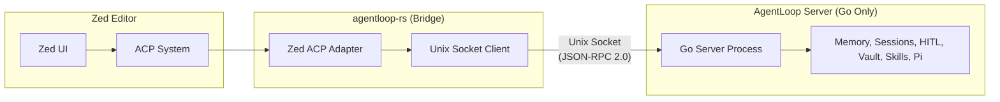

import { Aside } from '@astrojs/starlight/components';

## What Is the Rust ACP Bridge?

The AgentLoop Rust bridge is a **specialized ACP communication library** designed exclusively for **Zed editor integration**. It connects Zed editor to the existing **AgentLoop Go server** via Unix socket using the Adaptive Code Provider (ACP) protocol. Written in Rust with async/await support, it provides type-safe access to all AgentLoop server features.

<Aside type="caution">
  **Important Clarification**: The `agentloop-rs` repository contains **ONLY a client bridge**, not a server implementation. All server functionality remains in the Go AgentLoop server. This bridge exists purely to enable Zed editor integration with AgentLoop.
</Aside>

## Philosophy: ACP Bridge, Not Server

The Rust client is a **thin communication bridge** specifically designed for Zed editor's ACP system. It connects to the existing **AgentLoop Go server** - there is no Rust server implementation. All intelligence remains in the Go server.



## Key Features

- **Zed ACP Integration**: Primary focus on Zed editor's Adaptive Code Provider system
- **Memory Safe**: Written in Rust with zero unsafe code  
- **Async/Await**: Built on Tokio for high-performance concurrent operations
- **JSON-RPC 2.0**: Full compatibility with AgentLoop Go server protocol
- **Event Streaming**: Real-time agent events with backpressure handling
- **Type Safety**: Full type checking for all RPC calls and responses
- **Bridge Architecture**: Thin layer that forwards ACP requests to Go server

## What the Client Provides vs Doesn't

| Client Provides | Client Does NOT Provide |
|---|---|
| Unix socket connection management | Agent logic or execution |
| JSON-RPC 2.0 protocol implementation | Memory or context management |
| Event streaming with backpressure | Session lifecycle decisions |
| Type-safe API for all server methods | HITL decision making (only relays) |
| Reconnection and error handling | Prompt building or caching |
| Zed ACP integration adapter | Skills or tool management |

## Protocol Compatibility

The Rust client maintains **100% API compatibility** with the Go AgentLoop server:

| AgentLoop Method | Client Method | Purpose |
|---|---|---|
| `task.start` | `start_task()` | Begin new agent task |
| `task.steer` | `steer_task()` | Redirect running task |
| `task.abort` | `abort_task()` | Stop current task |
| `hitl.respond` | `respond_hitl()` | Approve/deny HITL request |
| `session.list` | Available via raw RPC | List user sessions |
| `memory.get` | Available via raw RPC | Get user memory context |
| `health.check` | `health_check()` | Server health status |

## Event Streaming

Real-time events from the server are delivered via async channels:

```rust
let mut event_rx = client.take_event_receiver().unwrap();
while let Some(event) = event_rx.recv().await {
    match event {
        AgentEvent::Text { session_id, content } => {
            println!("Agent output: {}", content);
        }
        AgentEvent::ToolUse { tool_name, .. } => {
            println!("Using tool: {}", tool_name);
        }
        AgentEvent::HITLRequest { request_id, details, .. } => {
            // Show approval dialog to user
            let decision = show_approval_dialog(&details).await;
            client.respond_hitl(&session_id, &request_id, decision).await?;
        }
        AgentEvent::Done { stats, .. } => {
            println!("Task completed: {} tool calls", stats.tool_calls);
            break;
        }
        _ => {}
    }
}
```

## Use Cases

### Zed Editor Integration

The `zed-acp` feature provides a specialized adapter for Zed's Adaptive Code Provider system:

```rust
use agentloop_bridge::zed_acp::ZedACPAdapter;

let mut adapter = ZedACPAdapter::new(config, user_id);
let result = adapter.execute_coding_task(
    "Fix the compilation errors in this Rust project",
    Some("/path/to/project")
).await?;
```

### Custom CLI Tools

Direct client integration for command-line tools:

```rust
use agentloop_bridge::{AgentLoopClient, ClientConfig};

let mut client = AgentLoopClient::new(ClientConfig::default());
client.connect().await?;

let session_id = client.start_task(
    "user123",
    "Analyze this codebase for security issues",
    Some(workspace_path),
    "custom-cli"
).await?;

let stats = client.wait_for_completion(&session_id).await?;
```

### Embedded Applications

The client can be embedded in larger Rust applications to add AI capabilities:

```rust
// In your application
let mut agent_client = AgentLoopClient::new(config);
// Agent capabilities are now available throughout your app
```

## Integration with Existing AgentLoop

The Rust ACP bridge connects to existing **AgentLoop Go servers** without requiring any changes:

1. **Same Protocol**: Uses identical JSON-RPC 2.0 over Unix socket  
2. **Same Features**: Access to all Go server capabilities (memory, HITL, sessions)
3. **Same Vault**: Shares the same Markdown+YAML vault format
4. **Zero Disruption**: Works alongside existing CLI and Slack bridge clients

<Aside type="note">
  The Rust bridge is designed to add Zed editor support to existing AgentLoop Go installations. It does NOT replace any server components - all intelligence remains in the Go server.
</Aside>
