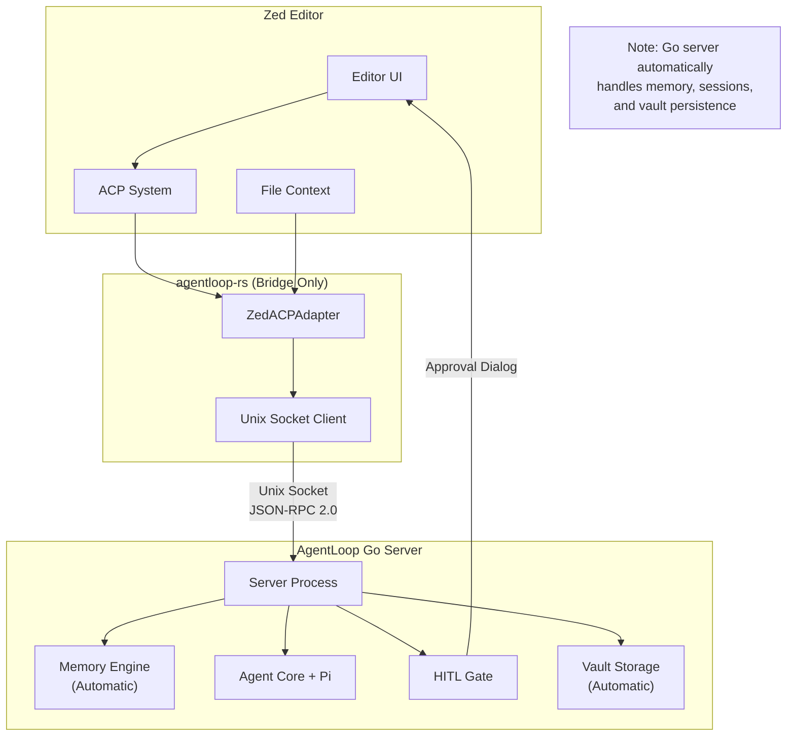

import { Aside, Code, FileTree, Tabs, TabItem } from '@astrojs/starlight/components';

## Overview

The AgentLoop Rust ACP bridge provides **dedicated integration** between Zed editor and the **AgentLoop Go server** through the **Adaptive Code Provider (ACP)** system. This enables seamless AI assistance directly within Zed with full access to AgentLoop's memory management, HITL approval, and session handling powered by the Go server.

<Aside type="important">
  **Memory & Session Management**: The AgentLoop Go server **automatically handles all memory management, conversation logging, and session persistence**. The Rust bridge simply forwards requests - no memory extensions or additional persistence logic is needed in the client.
</Aside>

## Architecture



## Prerequisites

- **Zed Editor**: Latest version with ACP support
- **Rust Toolchain**: 1.70+ via rustup  
- **AgentLoop Go Server**: Must be running (from main agentloop repository)
- **Pi Agent**: npm install -g @mariozechner/pi-coding-agent@latest
- **Feature Flag**: Enable `zed-acp` feature in bridge

## Installation

### Step 1: Add Dependency

```toml title="Cargo.toml" {3}
[dependencies]
agentloop-bridge = { 
    git = "https://github.com/user/agentloop-rs", 
    features = ["zed-acp"] 
}
tokio = { version = "1.0", features = ["full"] }
tracing = "0.1"
```

### Step 2: Create Zed Extension

<FileTree>
- zed-agentloop/
  - Cargo.toml
  - src/
    - lib.rs
  - extension.toml
</FileTree>

```toml title="zed-agentloop/extension.toml"
id = "agentloop"
name = "AgentLoop"
description = "AI coding assistant with memory and HITL approval"
version = "0.1.0"
schema_version = 1
authors = ["Your Name <your.email@example.com>"]

[language_servers.agentloop]
name = "AgentLoop ACP"
language = "rust"  # Or "*" for all languages

[grammars.agentloop]
name = "agentloop-acp"
```

```toml title="zed-agentloop/Cargo.toml"
[package]
name = "zed-agentloop"
version = "0.1.0"
edition = "2021"

[lib]
crate-type = ["cdylib"]

[dependencies]
agentloop-bridge = { git = "https://github.com/user/agentloop-rs", features = ["zed-acp"] }
zed_extension_api = "0.0.6"
tokio = { version = "1.0", features = ["full"] }
tracing = "0.1"
tracing-subscriber = "0.3"
serde_json = "1.0"
```

### Step 3: Implement Extension

```rust title="zed-agentloop/src/lib.rs"
use agentloop_bridge::{ClientConfig, zed_acp::ZedACPAdapter};
use std::collections::HashMap;
use zed_extension_api::{self as zed, Result};

struct AgentLoopExtension {
    adapters: HashMap<zed::LanguageServerId, ZedACPAdapter>,
}

impl zed::Extension for AgentLoopExtension {
    fn new() -> Self {
        // Initialize logging
        tracing_subscriber::fmt::init();
        
        Self {
            adapters: HashMap::new(),
        }
    }

    fn language_server_command(
        &mut self,
        language_server_id: &zed::LanguageServerId,
        worktree: &zed::Worktree,
    ) -> Result<zed::Command> {
        // Create adapter for this language server instance
        let config = ClientConfig::default();
        let user_id = self.get_user_id()?;
        let adapter = ZedACPAdapter::new(config, user_id);
        
        self.adapters.insert(language_server_id.clone(), adapter);

        // Return command to start the ACP bridge
        Ok(zed::Command {
            command: "agentloop-acp-bridge".to_string(),
            args: vec![
                "--socket-path".to_string(),
                config.socket_path.to_string_lossy().to_string(),
                "--workspace".to_string(),
                worktree.abs_path().to_string_lossy().to_string(),
            ],
            env: HashMap::new(),
        })
    }

    fn language_server_workspace_configuration(
        &mut self,
        language_server_id: &zed::LanguageServerId,
        worktree: &zed::Worktree,
    ) -> Result<Option<serde_json::Value>> {
        Ok(Some(serde_json::json!({
            "agentloop": {
                "enabled": true,
                "socket_path": ClientConfig::default().socket_path,
                "workspace_path": worktree.abs_path(),
                "user_id": self.get_user_id()?,
                "features": {
                    "memory": true,
                    "hitl": true,
                    "skills": true
                }
            }
        })))
    }
}

impl AgentLoopExtension {
    fn get_user_id(&self) -> Result<String> {
        // Get user ID from environment or system
        std::env::var("USER")
            .or_else(|_| std::env::var("USERNAME"))
            .map_err(|_| "Could not determine user ID".into())
    }
}

zed::register_extension!(AgentLoopExtension);
```

## Usage in Zed

### Context-Aware Tasks

The Zed integration automatically provides file and workspace context:

```rust
// This is called when user triggers AgentLoop command
pub async fn execute_coding_task(
    &mut self,
    prompt: &str,
    workspace_path: Option<&str>,
) -> Result<String> {
    // Connect if not already connected
    if !self.client.is_connected() {
        self.client.connect().await?;
    }

    // Build context-aware prompt
    let enhanced_prompt = self.build_context_prompt(prompt, workspace_path).await?;

    // Start task with full context
    let session_id = self.client.start_task(
        &self.current_user,
        &enhanced_prompt,
        workspace_path.map(String::from),
        "zed-acp"
    ).await?;

    // Stream results back to editor
    self.stream_to_editor(&session_id).await
}
```

### Available Commands

Once installed, these commands become available in Zed:

| Command | Description | Shortcut |
|---------|-------------|----------|
| `agentloop: Fix Issues` | Analyze and fix compilation errors | `Ctrl+Shift+F` |
| `agentloop: Explain Code` | Explain selected code with context | `Ctrl+Shift+E` |
| `agentloop: Generate Tests` | Create tests for current file | `Ctrl+Shift+T` |
| `agentloop: Refactor` | Suggest refactoring improvements | `Ctrl+Shift+R` |
| `agentloop: Custom Task` | Run custom prompt with file context | `Ctrl+Shift+A` |

### HITL Approval in Editor

When the agent needs approval for potentially dangerous operations, Zed shows native dialogs:

```rust
pub async fn handle_hitl_approval(
    &mut self,
    session_id: &str,
    request_id: &str,
    tool_name: &str,
    details: &str,
) -> Result<HITLDecision> {
    // Show Zed dialog for approval
    let dialog_result = zed::editor::show_dialog(&format!(
        "AgentLoop wants to use tool '{}'\n\n{}\n\nAllow this operation?",
        tool_name, details
    ), &["Allow", "Deny", "Abort Task"]).await?;

    let decision = match dialog_result {
        0 => HITLDecision::Approve,
        1 => HITLDecision::Deny,
        2 => HITLDecision::Abort,
        _ => HITLDecision::Deny,
    };

    // Send decision to server
    self.client.respond_hitl(session_id, request_id, decision.clone()).await?;
    Ok(decision)
}
```

## Configuration

### User Settings

```json title="~/.config/zed/settings.json"
{
  "agentloop": {
    "enabled": true,
    "socket_path": "~/.local/share/agentloop/agentloop.sock",
    "user_id": "your_username",
    "auto_approve_safe_tools": ["read", "grep", "find"],
    "context": {
      "include_open_files": true,
      "include_git_status": true,
      "max_context_files": 10
    },
    "ui": {
      "show_tool_usage": true,
      "stream_output": true,
      "highlight_changes": true
    }
  }
}
```

<Aside type="note">
  **No Memory Configuration Needed**: Memory management, conversation history, and session persistence are handled automatically by the AgentLoop Go server. The Rust bridge only needs connection settings.
</Aside>
```

### Workspace Settings

```json title=".zed/settings.json"
{
  "agentloop": {
    "project_context": {
      "language": "rust",
      "framework": "tokio",
      "test_framework": "cargo test",
      "build_system": "cargo"
    },
    "custom_prompts": {
      "fix_clippy": "Fix all clippy warnings in this Rust project",
      "add_docs": "Add comprehensive documentation to this module",
      "optimize": "Optimize this code for performance and readability"
    }
  }
}
```

## Advanced Usage

### Custom Context Building

```rust
async fn build_context_prompt(&self, prompt: &str, workspace_path: Option<&str>) -> Result<String> {
    let mut context = String::new();
    
    // Add workspace info
    if let Some(workspace) = workspace_path {
        context.push_str(&format!("Workspace: {}\n", workspace));
        
        // Add relevant files
        let files = self.get_relevant_files(workspace).await?;
        for file in files {
            context.push_str(&format!("File: {}\n", file));
        }
    }
    
    // Add current file context
    if let Some(current_file) = self.get_current_file().await? {
        context.push_str(&format!("\nCurrent file: {}\n", current_file));
    }
    
    // Add git context
    if let Some(git_status) = self.get_git_status().await? {
        context.push_str(&format!("\nGit status: {}\n", git_status));
    }
    
    // Combine with user prompt
    Ok(format!("{}\n\nUser request: {}", context, prompt))
}
```

### Streaming Output to Editor

```rust
async fn stream_to_editor(&mut self, session_id: &str) -> Result<String> {
    let mut output = String::new();
    let mut event_rx = self.client.take_event_receiver().unwrap();
    
    while let Some(event) = event_rx.recv().await {
        match event {
            AgentEvent::Text { content, .. } => {
                // Stream text to editor output panel
                zed::editor::append_to_output(&content).await?;
                output.push_str(&content);
            }
            AgentEvent::ToolUse { tool_name, .. } => {
                zed::editor::show_status(&format!("Using tool: {}", tool_name)).await?;
            }
            AgentEvent::HITLRequest { request_id, tool_name, details, .. } => {
                let decision = self.handle_hitl_approval(session_id, &request_id, &tool_name, &details).await?;
                if matches!(decision, HITLDecision::Abort) {
                    break;
                }
            }
            AgentEvent::Done { stats, .. } => {
                zed::editor::show_status(&format!(
                    "Task completed: {} tool calls, {} HITL requests", 
                    stats.tool_calls, stats.hitl_requests
                )).await?;
                break;
            }
            AgentEvent::Error { message, .. } => {
                zed::editor::show_error(&message).await?;
                return Err(message.into());
            }
            _ => {}
        }
    }
    
    Ok(output)
}
```

## Troubleshooting

### Extension Not Loading

**Check Zed logs:**
```bash
tail -f ~/.local/share/zed/logs/Zed.log | grep agentloop
```

**Common issues:**
- Missing `zed-acp` feature flag
- Incorrect extension.toml format  
- Compilation errors in extension

### Connection Issues

**Server not running:**
```bash
# Check if AgentLoop server is running
ps aux | grep agentloop-server

# Check socket exists
ls -la ~/.local/share/agentloop/agentloop.sock
```

**Permission problems:**
```bash
# Ensure socket is accessible
chmod 700 ~/.local/share/agentloop/agentloop.sock
```

### Performance Issues

**Large context:**
- Limit `max_context_files` in settings
- Exclude large directories from context
- Use project-specific `.zed/settings.json`

**Memory usage:**
- Monitor event buffer size
- Implement backpressure handling
- Close unused sessions

<Aside type="tip">
  **Development Tip**: Use `cargo build --release` for production Zed extensions to minimize performance impact on the editor.
</Aside>

## Examples

Complete working examples are available in the `examples/zed_integration.rs` file in the agentloop-rs repository. This includes:

- Basic ACP setup
- Context-aware prompting  
- Event streaming to editor
- HITL dialog integration
- Error handling and recovery