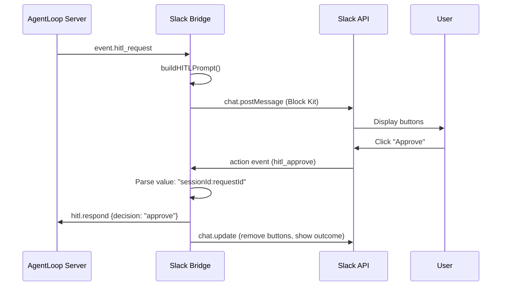

import { Aside } from '@astrojs/starlight/components';

## How It Looks

When the agent encounters a risky operation, a Block Kit message appears in the thread:

```
🔒 Tool Approval Required

Tool: bash
Details: docker run -v ~/project:/app ubuntu:latest

[✅ Approve]  [❌ Deny]  [🛑 Abort Task]
```

## How It Works



1. Bridge receives `event.hitl_request` from AgentLoop
2. `buildHITLPrompt()` in `blocks.ts` creates the Block Kit message
3. Message is posted to the Slack thread with three buttons
4. User clicks a button
5. `actions.ts` handles the click, parses the button value
6. Bridge sends `hitl.respond` to AgentLoop with the decision
7. Original message is updated to show the outcome

## Button Value Encoding

Each button's `value` is encoded as `sessionId:requestId`:

```
sess-a1b2c3d4:hitl-req-1
```

This allows the action handler to correlate the click back to the correct session and HITL request.

## Action IDs

| Button | Action ID | Decision |
|--------|-----------|----------|
| Approve | `hitl_approve` | `approve` |
| Deny | `hitl_deny` | `deny` |
| Abort Task | `hitl_abort` | Calls `abortTask()` instead of `respondHITL()` |

## After Click

The original message is updated via `chat.update` to reflect the decision:

- **Approved:** "Approved by @user" (buttons removed)
- **Denied:** "Denied by @user" (buttons removed)
- **Aborted:** "Aborted by @user" (buttons removed)

## Details Truncation

HITL details are truncated to **2000 characters** in the Block Kit message to stay within Slack's limits. Block Kit section text has a **3000 character** maximum.

## Timeout

If no one clicks a button within `hitl.timeout_seconds` (default: **300 seconds**), the AgentLoop server automatically denies the request. The Slack message buttons become stale — clicking them after timeout will result in an error response from the server.

<Aside type="tip">
  If HITL timeouts are happening frequently, increase `hitl.timeout_seconds` in the AgentLoop server config, or ensure the relevant team members are monitoring the Slack channel.
</Aside>
