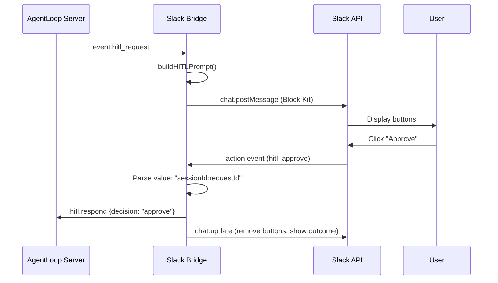

import { Aside } from '@astrojs/starlight/components';

## How It Looks

When the agent encounters a risky operation, an enriched Block Kit message appears in the thread:

```
🔴 HIGH risk · 💻 Code Execution

Tool: bash
Reason: Executing shell command with elevated privileges
Details: docker run -v ~/project:/app ubuntu:latest
Whitelisted paths: /home/marco/travel-app

[✅ Approve]  [❌ Deny]  [🛑 Abort Task]
```

### Enriched HITL Display

The approval prompt surfaces security metadata so reviewers can make informed decisions:

| Field | Description |
|---|---|
| **Risk badge** | 🔴 HIGH · 🟡 MEDIUM · 🟢 LOW — derived from the injection guard risk level |
| **Category icon** | 📂 File System · 💻 Code Execution · 🌐 Network · ⚙️ System · 🔧 Tool — based on tool category |
| **Reason** | Human-readable explanation from the security policy (e.g. "Executing shell command with elevated privileges") |
| **Structured input** | Tool arguments shown as labeled fields rather than a raw JSON blob |
| **Whitelisted paths** | If the operation involves paths, any pre-approved paths are listed for context |

The `buildHITLPrompt()` function in `blocks.ts` assembles all these fields from the `event.hitl_request` payload.

## How It Works


```mermaid
sequenceDiagram
    participant A as AgentLoop Server
    participant B as Slack Bridge
    participant S as Slack API
    participant U as User

    A->>B: event.hitl_request
    B->>B: buildHITLPrompt()
    B->>S: chat.postMessage (Block Kit)
    S->>U: Display buttons

    U->>S: Click "Approve"
    S->>B: action event (hitl_approve)
    B->>B: Parse value: "sessionId:requestId"
    B->>A: hitl.respond {decision: "approve"}
    B->>S: chat.update (remove buttons, show outcome)
```

1. Bridge receives `event.hitl_request` from AgentLoop
2. `buildHITLPrompt()` in `blocks.ts` creates the Block Kit message
3. Message is posted to the Slack thread with three buttons
4. User clicks a button
5. `actions.ts` handles the click, parses the button value
6. Bridge sends `hitl.respond` to AgentLoop with the decision
7. Original message is updated to show the outcome

## Button Value Encoding

Each button's `value` is encoded as `sessionId:requestId`:

```
sess-a1b2c3d4:hitl-req-1
```

This allows the action handler to correlate the click back to the correct session and HITL request.

## Action IDs

| Button | Action ID | Decision |
|--------|-----------|----------|
| Approve | `hitl_approve` | `approve` |
| Deny | `hitl_deny` | `deny` |
| Abort Task | `hitl_abort` | Calls `abortTask()` instead of `respondHITL()` |
| Abort (session list) | `session_abort` | Calls `abortTask()` from `/sessions` or `/abort` list view |

## After Click

The original message is updated via `chat.update` to reflect the decision:

- **Approved:** "Approved by @user" (buttons removed)
- **Denied:** "Denied by @user" (buttons removed)
- **Aborted:** "Aborted by @user" (buttons removed)

## Details Truncation

HITL details are truncated to **2000 characters** in the Block Kit message to stay within Slack's limits. Block Kit section text has a **3000 character** maximum.

## Auto-Approval

Low and medium-risk tool calls can be auto-approved without user input when `auto_approve_non_high: true` is set in the bridge config:

```yaml
# bridge config (e.g. bridge.config.yaml or .env)
HITL_AUTO_APPROVE_NON_HIGH=true
```

**How it works:**

1. Bridge receives `event.hitl_request` with a risk level of `LOW` or `MEDIUM`
2. Instead of posting interactive buttons, the bridge immediately sends `hitl.respond` with `decision: "approve"`
3. A compact acknowledgment message is posted to the thread (no buttons):

```
✅ Auto-approved · 🟢 LOW risk · 📂 File System

Tool: read
```

4. The `hitl_auto_approved` event is recorded in the session transcript for audit purposes

**Tiered security model:**

| Risk Level | `auto_approve_non_high: false` | `auto_approve_non_high: true` |
|---|---|---|
| 🔴 HIGH | Always requires manual approval | Always requires manual approval |
| 🟡 MEDIUM | Requires manual approval | Auto-approved |
| 🟢 LOW | Requires manual approval | Auto-approved |

<Aside type="caution">
  Auto-approval bypasses human review for MEDIUM and LOW risk operations. Only enable this if you trust the agent's risk classification and your security policy extension is correctly configured.
</Aside>

## Timeout

If no one clicks a button within `hitl.timeout_seconds` (default: **300 seconds**), the AgentLoop server automatically denies the request. The Slack message buttons become stale — clicking them after timeout will result in an error response from the server.

<Aside type="tip">
  If HITL timeouts are happening frequently, increase `hitl.timeout_seconds` in the AgentLoop server config, or ensure the relevant team members are monitoring the Slack channel.
</Aside>
