## Full Message Flow

```mermaid
sequenceDiagram
    participant U as Slack User
    participant S as Slack API
    participant B as Slack Bridge
    participant A as AgentLoop Server
    participant Pi as pi subprocess

    U->>S: Send DM
    S->>B: message.im event (WebSocket)
    B->>B: Check allowlist + rate limit
    B->>A: task.start (Unix socket)
    A-->>B: {sessionId, status}
    B->>B: Map sessionId ↔ thread
    B->>S: Add 👀 reaction

    A->>Pi: Launch subprocess, send prompt
    Pi-->>A: event.text chunks
    A-->>B: event.text
    B->>B: Buffer text (1s debounce)
    B->>S: chat.postMessage / chat.update

    Pi-->>A: event.tool_use
    A-->>B: event.tool_use
    B->>S: "⏳ Using tool: `toolName`"

    Pi-->>A: event.hitl_request
    A-->>B: event.hitl_request
    B->>S: Block Kit buttons (Approve/Deny/Abort)

    U->>S: Click button
    S->>B: action event
    B->>A: hitl.respond

    Pi-->>A: event.done
    A-->>B: event.done
    B->>S: Final result message
    B->>S: Replace 👀 with ✅
    B->>B: Cleanup listeners + session map
```



## Event Mapping

Each AgentLoop event becomes a specific Slack message:

| AgentLoop Event | Slack Output |
|---|---|
| `event.text` | Accumulated text, posted as message (updated every ~1s) |
| `event.tool_use` | Thread reply: "Using tool: \`toolName\`" |
| `event.tool_result` | (Not posted by default — results are in the text stream) |
| `event.hitl_request` | Block Kit message with Approve/Deny/Abort buttons |
| `event.done` | Final output with stats. If > 3500 chars, full output uploaded as `.md` file |
| `event.error` | Error message in thread |

## Text Streaming

Text events are buffered to avoid Slack API spam:

1. `event.text` chunks accumulate in a `textChunks[]` array
2. A debounce timer flushes every **1 second** (`TEXT_FLUSH_INTERVAL_MS`)
3. First flush creates a new Slack message via `chat.postMessage`
4. Subsequent flushes update the same message via `chat.update`
5. On `event.done`: cancel timer, flush remaining text, post final result

## Reaction Lifecycle

| Stage | Reaction |
|-------|----------|
| Task started | 👀 (eyes) added to original message |
| Task succeeded | 👀 removed, ✅ (white_check_mark) added |
| Task failed | 👀 removed, ❌ (x) added |

## Thread Model

All agent responses are posted as **thread replies** under the user's original message:

```
User: "fix the failing tests"  [👀 → ✅]
  └─ Thread:
     ├─ ⏳ Using tool: `bash`
     ├─ Streamed text output...
     ├─ ⏳ Using tool: `edit`
     └─ ✅ Done (tokens: 3200, tools: 3, duration: 12.5s)
```

## Work Directory Prefix

Users can specify a working directory in their message:

```
in ~/travel-app fix the failing tests
```

The bridge parses the `in ~/path` prefix and forwards it as `workDir` in the `task.start` call.

## Steer via Thread Reply

If a user replies in a thread that has an active session, the reply is sent as a `task.steer` instead of starting a new task:

```
User: "fix the tests"          → task.start
  └─ User: "actually, focus on auth tests only" → task.steer
```
