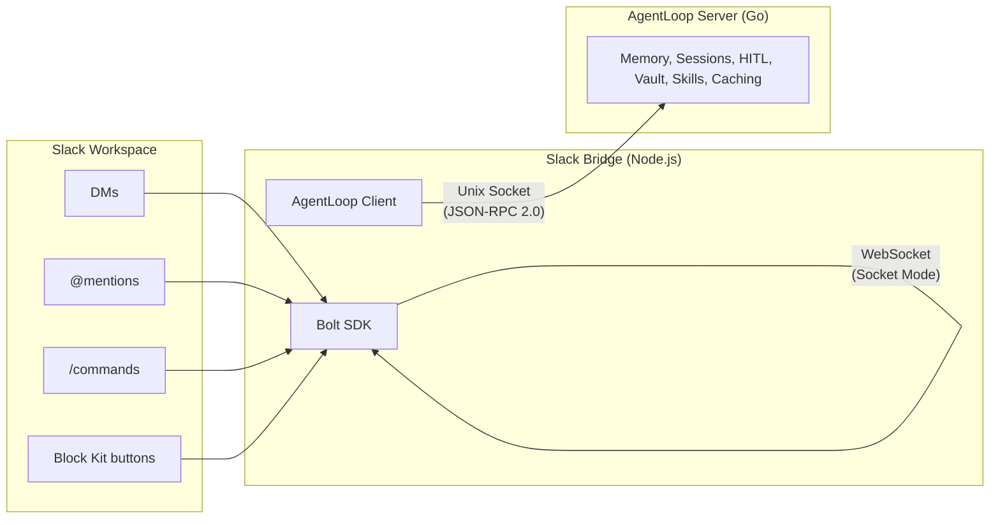

import { Aside } from '@astrojs/starlight/components';

## What Is the Slack Bridge?

The Slack Bridge is a **thin transport layer** between Slack and the AgentLoop server. Written in Node.js/TypeScript using the Bolt SDK, it translates Slack events into AgentLoop JSON-RPC calls and streams agent events back as Slack messages.

## Philosophy: Zero Intelligence in the Bridge

All intelligence lives in the AgentLoop Go server. The bridge is deliberately stateless and replaceable.

## What the Bridge Owns vs Doesn't

| Bridge Owns | Bridge Does NOT Own |
|---|---|
| Slack authentication (bot + app tokens) | Memory, context, compaction |
| User allowlist (fail-closed) | Sessions, agent logic, orchestration |
| Rate limiting (per-user sliding window) | HITL decisions (just relays approve/deny/abort) |
| Slack message formatting (Block Kit) | Skills, tools, vault, pi management |
| Session-to-thread mapping (in-memory) | Prompt caching or context assembly |

## Why This Split?

- **Bridge is replaceable** — Swap it for a Discord bot, web UI, or any other client without touching AgentLoop
- **Bridge is stateless** — All state lives in the AgentLoop server, the bridge just translates
- **Bridge is easy to deploy** — Simple Node.js process, few dependencies
- **Bridge is safe** — It can't make agent decisions, only relay user input

## Message Translation

| Slack Event | AgentLoop RPC Call |
|---|---|
| DM or @mention | `task.start` |
| Thread reply to active session | `task.steer` |
| `/abort` command | `task.abort` |
| HITL button click (Approve/Deny) | `hitl.respond` |
| AgentLoop events | Slack messages in thread |

<Aside type="note">
  If you find yourself adding logic that "decides" something about how the agent behaves, it belongs in the AgentLoop Go server, not in the bridge.
</Aside>
