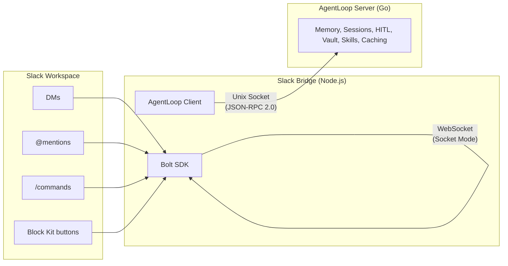

import { Aside } from '@astrojs/starlight/components';

## What Is the Slack Bridge?

The Slack Bridge is a **thin transport layer** between Slack and the AgentLoop server. Written in Node.js/TypeScript using the Bolt SDK, it translates Slack events into AgentLoop JSON-RPC calls and streams agent events back as Slack messages.

## Philosophy: Zero Intelligence in the Bridge

All intelligence lives in the AgentLoop Go server. The bridge is deliberately stateless and replaceable.

```mermaid
graph LR
    subgraph "Slack Workspace"
        DM["DMs"]
        Mention["@mentions"]
        Cmd["/commands"]
        Btn["Block Kit buttons"]
    end

    subgraph "Slack Bridge (Node.js)"
        Bolt["Bolt SDK"]
        Client["AgentLoop Client"]
    end

    subgraph "AgentLoop Server (Go)"
        Intelligence["Memory, Sessions, HITL, Vault, Skills, Caching"]
    end

    DM --> Bolt
    Mention --> Bolt
    Cmd --> Bolt
    Btn --> Bolt
    Bolt -->|"WebSocket<br/>(Socket Mode)"| Bolt
    Client -->|"Unix Socket<br/>(JSON-RPC 2.0)"| Intelligence
```

## What the Bridge Owns vs Doesn't

| Bridge Owns | Bridge Does NOT Own |
|---|---|
| Slack authentication (bot + app tokens) | Memory, context, compaction |
| User allowlist (fail-closed) | Sessions, agent logic, orchestration |
| Rate limiting (per-user sliding window) | HITL decisions (just relays approve/deny/abort) |
| Slack message formatting (Block Kit) | Skills, tools, vault, pi management |
| Session-to-thread mapping (in-memory) | Prompt caching or context assembly |

## Why This Split?

- **Bridge is replaceable** — Swap it for a Discord bot, web UI, or any other client without touching AgentLoop
- **Bridge is stateless** — All state lives in the AgentLoop server, the bridge just translates
- **Bridge is easy to deploy** — Simple Node.js process, few dependencies
- **Bridge is safe** — It can't make agent decisions, only relay user input

## Key Features

| Feature | Description |
|---|---|
| **Text streaming** | Agent text chunks buffered and flushed every ~1s via `chat.update` |
| **Thread status** | Slack typing indicator set via `setThreadStatus` while agent is running |
| **HITL approval** | Block Kit buttons (Approve / Deny / Abort Task) posted per risk operation |
| **Auto-approval** | Low/medium-risk tool calls auto-approved when `auto_approve_non_high: true`; bridge posts a compact acknowledgment message instead of waiting for input |
| **Enriched HITL display** | Risk badge (🔴🟡🟢), category icon (📂💻🌐⚙️🔧), reason field, and structured input shown in the approval prompt |
| **Assistant app** | Works as a Slack Assistant with structured thread context for DM interactions |
| **Session abort** | `/abort` and `/sessions` both provide per-session Abort buttons; `/sessions` lists all active sessions with an inline Abort button on each row |

## Message Translation

| Slack Event | AgentLoop RPC Call |
|---|---|
| DM or @mention | `task.start` |
| Thread reply to active session | `task.steer` |
| `/abort` command | `task.abort` |
| HITL button click (Approve/Deny/Abort) | `hitl.respond` / `task.abort` |
| Auto-approved tool call | (no user input required; `hitl_auto_approved` event logged) |
| AgentLoop events | Slack messages in thread |

<Aside type="note">
  If you find yourself adding logic that "decides" something about how the agent behaves, it belongs in the AgentLoop Go server, not in the bridge.
</Aside>
