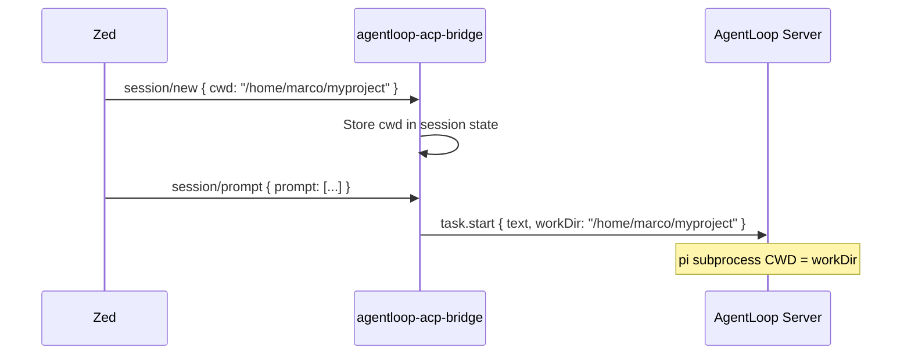

import { Aside } from '@astrojs/starlight/components';

## How File Context Flows to AgentLoop

When you send a prompt in the Zed Agent panel, Zed includes the **current working directory** (`cwd`) in the `session/new` ACP call. The bridge forwards `cwd` as the `workDir` parameter in `task.start`, which is the directory AgentLoop's pi subprocess uses as its working directory.



### What pi Can Access

The pi subprocess runs with the same OS user as the AgentLoop server. It can read, write, and execute within the bounds set by the security policy. By default:

- **Working directory** — full read/write access (pi starts here)
- **Allowed paths** — additional directories whitelisted in `security.allowed_paths`
- **Blocked paths** — anything outside allowed paths is rejected by the security policy extension

## Markdown Link Syntax for File References

You can reference specific files directly in your prompt using standard Markdown link syntax. The AgentLoop agent resolves these as filesystem paths relative to the session's `workDir`:

```
Fix the bug in [src/main.rs](src/main.rs) — the error is on line 42.
```

Or with absolute paths:

```
Review [/home/marco/myproject/src/auth.go](/home/marco/myproject/src/auth.go)
```

The pi agent's `read` tool is used internally to load the referenced file content before reasoning about it. File links are **not** preprocessed by the bridge — they are passed as plain text to the AgentLoop server, which lets the agent decide when and whether to read them.

<Aside type="note">
  The bridge's `ZedACPAdapter` also performs a shallow workspace scan (top-level source files only) when building context prompts programmatically. This is a best-effort enrichment — the agent always has direct filesystem access via its tools.
</Aside>

## Context Prompt Format

For multi-turn conversations, the bridge wraps the full conversation history in a structured tag:

```
<conversation_history>
[user]: Fix the bug in src/auth.go
[assistant]: I've read the file. The issue is on line 42 where...
[user]: Now add a test for that fix
</conversation_history>

Please continue the conversation above. Respond to the last [user] message.
```

For the **first turn only**, no wrapper is added — the raw prompt text is sent directly. This keeps single-turn requests clean and avoids unnecessary boilerplate.

## Limits

| Limit | Value | Notes |
|---|---|---|
| Conversation history depth | Unbounded in bridge | Server token budget caps the effective depth |
| File content in prompt | Up to server token budget | Large files may exhaust context window |
| HITL `details` field | 50,000 chars (soft) | Truncated by injection guard at server level |
| ACP request timeout | 120 seconds | Bridge HITL response timeout |
| `session/request_permission` wait | 120 seconds | After which HITL is auto-denied |

## 5-Layer Security Stack

File access goes through five independent enforcement layers. A request must pass all of them.

### Layer 1: ACP Bridge Input Validation

The bridge validates that all incoming ACP messages are well-formed JSON-RPC 2.0. Malformed or unknown methods are rejected with error code `-32601`. No filesystem access occurs at this layer.

### Layer 2: Go Security Policy (`internal/security/policy.go`)

Before launching a pi subprocess, the AgentLoop server validates the `workDir` path using `ValidatePath()`:

- **Path traversal blocked** — `../../etc/passwd` and similar patterns are rejected
- **Allowed paths enforced** — `workDir` must be a prefix-match of an entry in `security.allowed_paths`
- **SSRF protection** — `ValidateURL()` blocks requests to private IP ranges

### Layer 3: Environment Sanitization (`bridge/rpc.go`)

`buildSafeEnv()` strips sensitive environment variables (matching `security.blocked_env_prefixes`) before the pi subprocess starts. The subprocess cannot exfiltrate secrets it never sees.

### Layer 4: TypeScript Extension — `security-policy.ts`

The pi extension intercepts every `tool_call` event before execution:

- **Dangerous bash patterns** — `rm -rf /`, `curl | bash`, `/etc/shadow` references, etc. are blocked outright
- **File write paths** — writes outside `allowed_paths` are blocked
- **All blocks are hard blocks** — not HITL prompts; they never reach the user

### Layer 5: TypeScript Extension — `prompt-injection-guard.ts`

Content read from risky sources (git repos, fetched URLs, cloud files, email attachments, node_modules) is analyzed for **prompt injection patterns** before being returned to the agent:

- `AGENTLOOP_INJECTION_PROTECTION=true` enables the guard (default: on)
- High-risk content triggers a HITL approval gate
- Detected injection patterns are sanitized or blocked per `AGENTLOOP_APPROVAL_TIER`

```
Source categories (risk-ordered):
  SourceUserInput        → always trusted
  SourceSkill            → validated
  SourceGitRepo          → analyzed
  SourceFetchResponse    → analyzed
  SourceCloudFile        → analyzed
  SourceEmailAttachment  → analyzed
  SourceNodeModules      → analyzed (highest risk)
```

<Aside type="caution">
  Passing user-controlled content (e.g. a URL from a Zed prompt) to a file-reading tool without HITL approval can expose the agent to prompt injection. The injection guard is your last line of defense — do not disable it in production.
</Aside>

## Whitelisting Trusted Source Paths

If a specific directory produces false positives in the injection guard, whitelist it in `agentloop.yaml`:

```yaml
security:
  injection:
    whitelist_sources:
      - /home/marco/trusted-scripts
      - /home/marco/myproject/vendor
```

Content from whitelisted paths bypasses injection analysis but still passes through Layers 1–4.
