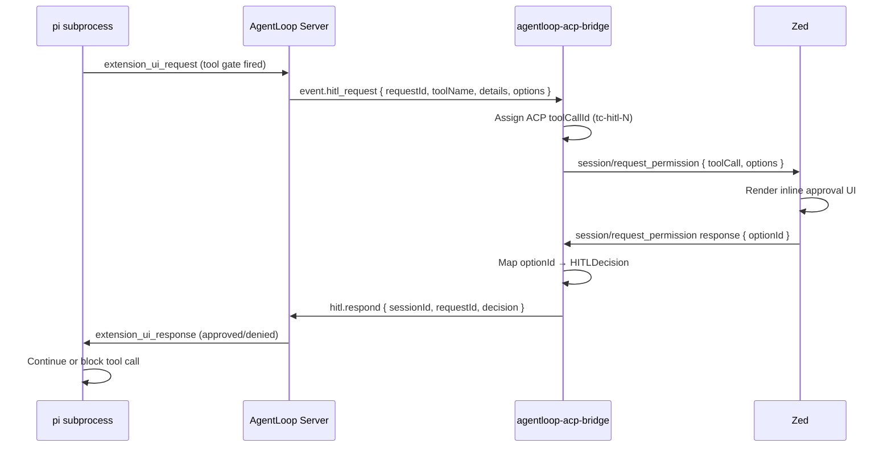

import { Aside } from '@astrojs/starlight/components';

## How It Looks

When the agent encounters a risky operation, the bridge sends a `session/request_permission` request to Zed. Zed renders it as an inline approval prompt in the Agent panel:

```
🔒 Permission Required

Tool: bash
Details: docker run -v ~/project:/app ubuntu:latest

[Allow Once]  [Reject Once]  [Reject Always]
```

The button labels map to AgentLoop HITL decisions. The user picks one and the agent continues.

## How It Works



## ACP Permission Options

AgentLoop sends an `options` array with the HITL request (e.g. `["Approve", "Deny", "Abort"]`). The bridge maps each option to an ACP `kind`:

| Option string (contains) | ACP `kind` | Maps to `HITLDecision` |
|---|---|---|
| `approve` / `allow` / `yes` | `allow_once` | `Approve` |
| `abort` | `reject_always` | `Abort` |
| anything else | `reject_once` | `Deny` |

If the user dismisses the dialog without choosing (or the 120-second timeout fires), the bridge returns `{"outcome": "cancelled"}`, which maps to `HITLDecision::Abort`.

## HITL Timeout

AgentLoop has a server-side HITL timeout (`hitl.timeout_seconds`, default: **300 seconds**). If no decision arrives within that window, the server automatically denies the request. The Zed permission dialog may remain visible after this — clicking a button after timeout will result in a "request not found" error from the server.

The bridge also has a client-side timeout of **120 seconds** for the `session/request_permission` round-trip. If Zed takes longer than 120 seconds to respond, the bridge sends `Abort` to the server without waiting.

<Aside type="tip">
  If timeouts are frequent, increase `hitl.timeout_seconds` in `agentloop.yaml`. The two timeouts are independent — the server timeout is the authoritative one.
</Aside>

## Auto-Approved Events

Not all tool calls trigger HITL. The security extensions make the decision based on risk:

| Tool / Operation | Behaviour |
|---|---|
| `read` (file read) | Auto-allowed — never triggers HITL |
| `ls`, `find`, `grep` | Auto-allowed — read-only operations |
| `bash` (safe commands) | Auto-allowed if no blocked patterns match |
| `bash` (docker, curl, rm -rf, etc.) | **HITL gate or hard block** |
| `write` / `edit` outside allowed paths | **Hard block** (not HITL) |
| `write` / `edit` inside allowed paths | Auto-allowed |
| Content from risky sources | HITL gate (injection guard) |

`security-policy.ts` handles the hard blocks. `docker-guard.ts` handles Docker commands. HITL requests come from the pi extension UI (`extension_ui_request`) for anything that passes hard blocks but still requires human judgment.

### Configuring Always-Pause Tools

To force HITL approval for specific tool names regardless of risk heuristics, list them in `agentloop.yaml`:

```yaml
hitl:
  always_pause_tools:
    - bash
    - write
```

With this config, every `bash` and `write` call will pause for approval, even if the security extension would have allowed it automatically.

## Conversation History and HITL

HITL pauses do not interrupt the conversation history tracked by the bridge. After a denial or approval, the agent continues the same ACP session and the next assistant response appends to the same history. If the task errors out due to a denied critical operation, the bridge removes the last user message from history to avoid polluting future turns with a failed exchange.

## Differences from Slack HITL

| Feature | Zed Bridge | Slack Bridge |
|---|---|---|
| UI | Inline in Agent panel | Block Kit message in thread |
| Buttons | Native Zed permission dialog | Slack buttons (3 buttons) |
| Timeout handling | 120s bridge + 300s server | 300s server (Slack buttons go stale) |
| Decision persistence | In-memory (session lifetime) | In-memory (process lifetime) |
| Multi-user approval | Not supported (single user) | Supported (any allowed user) |
