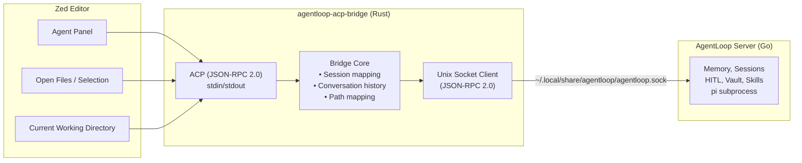

import { Aside } from '@astrojs/starlight/components';

## What Is the Zed Bridge?

The Zed Bridge makes AgentLoop available as a first-class **ACP agent** inside the [Zed editor](https://zed.dev). It consists of a single native binary — `agentloop-acp-bridge` — that Zed spawns as a subprocess. The bridge speaks the **Agent Client Protocol (ACP)** on stdin/stdout toward Zed, and **JSON-RPC 2.0 over Unix socket** toward the AgentLoop Go server.

**No intelligence lives in the bridge.** Memory, sessions, HITL, vault, skills, and prompt caching all remain in the AgentLoop server. The bridge is a thin, stateless translation layer — exactly like the Slack Bridge, just for a different transport.

## Architecture

## Why a Separate Binary?

Zed's extension API (WASM, `zed_extension_api` v0.7.0) does not yet expose an `agent_server_command` trait method — only `context_server_command` for MCP servers. Until that API ships, AgentLoop is registered as a **custom ACP agent** via `~/.config/zed/settings.json`. The `zed-agentloop` WASM extension crate exists in the repository and will be activated automatically once Zed adds the required API surface.

<Aside type="note">
  The `zed-agentloop` WASM extension is included in the repository but does nothing at runtime yet. All integration is handled by `agentloop-acp-bridge` + manual `settings.json` configuration until Zed ships `agent_server_command` in `zed_extension_api`.
</Aside>

## ACP ↔ AgentLoop Mapping

| ACP Method (Zed → Bridge) | AgentLoop RPC (Bridge → Server) | Notes |
|---|---|---|
| `initialize` | — | Handshake only; returns capabilities |
| `session/new {cwd}` | — | Creates local session state with `cwd` |
| `session/load {sessionId}` | — | Recreates session state if missing |
| `session/prompt {prompt}` | `task.start {userId, text, workDir}` | First turn; subsequent turns append conversation history |
| `session/prompt` (Nth turn) | `task.start` with `<conversation_history>` prefix | History injected by bridge |
| `session/cancel {sessionId}` | `task.abort {sessionId}` | Aborts the running AgentLoop task |
| `auth/getStatus` / `auth/signIn` | — | Immediately succeeded; auth is server-side |

| ACP Notification (Bridge → Zed) | AgentLoop Event | Notes |
|---|---|---|
| `session/update` (`agent_message_chunk`) | `event.text` | Streaming text chunk |
| `session/update` (`tool_call`) | `event.tool_use` | Tool invocation started |
| `session/update` (`tool_call_update`) | `event.tool_result` | Tool result (completed/failed) |
| `session/request_permission` | `event.hitl_request` | Human approval gate |
| `session/prompt` response (`stopReason: end_turn`) | `event.done` | Task completed |
| `session/prompt` error response | `event.error` | Task failed |

## Tool Kind Mapping

The bridge maps AgentLoop tool names to ACP `kind` hints so Zed can display appropriate icons:

| Tool name pattern | ACP kind |
|---|---|
| `read`, `ls`, `find`, `grep` | `read` |
| `write`, `edit`, `create` | `edit` |
| `delete`, `rm` | `delete` |
| `bash`, `exec`, `run` | `execute` |
| `fetch`, `curl`, `http` | `fetch` |
| `move`, `rename`, `mv` | `move` |
| anything else | `other` |

## Philosophy: Zero Intelligence in the Bridge

All decisions — what to remember, when to ask for HITL approval, which skills to use — are made by the AgentLoop server. The bridge cannot override or bypass them. If you find yourself adding decision logic to the bridge, it belongs in the server instead.

<Aside type="caution">
  The bridge stores conversation history **in memory only** for the duration of the process. If `agentloop-acp-bridge` restarts, multi-turn conversation context is lost. Vault persistence is handled server-side; the bridge does not write to disk.
</Aside>
