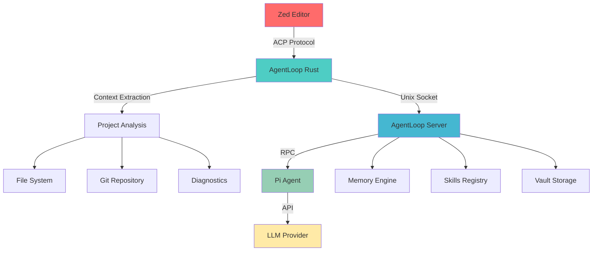

import { Aside } from '@astrojs/starlight/components';

## What is the Zed Integration?

The AgentLoop Zed integration brings powerful AI coding assistance directly into your Zed editor workflow. Unlike traditional AI coding tools that work with limited context, AgentLoop's Zed integration provides:

- **Full project awareness** - Understands your entire codebase structure
- **Git integration** - Knows about your changes, branches, and commit history  
- **Error context** - Automatically includes compiler errors and diagnostics
- **Multi-file operations** - Can edit multiple files in a single request
- **Rich context** - Combines file content, selection, project structure, and more

## Key Features

### 🧠 **Intelligent Context**
- Automatic project structure analysis
- Git status and recent commit awareness
- Compiler error and diagnostic integration
- Smart file relationship detection

### ⚡ **Performance**
- Built on Rust implementation for speed
- Local processing with no data leaving your machine
- Efficient context caching and management
- Minimal memory footprint

### 🔒 **Security & Privacy**
- All processing happens locally
- No code sent to external services (except your chosen LLM)
- Configurable security policies
- Human-in-the-loop approval for risky operations

### 🎯 **Editor Integration**
- Native Assistant Panel integration
- Inline code assistance (Cmd/Ctrl+K)
- Context-aware suggestions
- Multi-file refactoring support

## Architecture



### Components

| Component | Purpose | Implementation |
|-----------|---------|----------------|
| **Zed Extension** | UI integration, context collection | TypeScript |
| **AgentLoop Rust Bridge** | ACP protocol, context processing | Rust |
| **AgentLoop Server** | Session management, memory, skills | Rust |
| **Pi Agent** | LLM interaction, tool execution | Node.js |
| **LLM Provider** | AI inference (Anthropic, OpenAI, etc.) | External API |

## Context Types

The Zed integration automatically provides rich context to AgentLoop:

### File Context
- Current file content with syntax highlighting
- Cursor position and selection
- File metadata (size, modified time, language)
- Related files (imports, dependencies)

### Project Context
- Directory structure (respecting .gitignore)
- Build configuration (Cargo.toml, package.json, etc.)
- Project metadata and dependencies
- Recently modified files

### Git Context
- Current branch and status
- Staged and unstaged changes
- Recent commit history
- Diff information for modified files

### Diagnostic Context
- Compiler errors and warnings
- Linter messages
- Type checker output
- Performance diagnostics

## Usage Patterns

### 1. **Code Explanation**
```rust
// Select complex code and ask: "Explain this function"
fn complex_algorithm(data: &[u8]) -> Result<Vec<Transform>, Error> {
    // AgentLoop sees: file context, selection, related types, docs
}
```

### 2. **Error Resolution**
```bash
error[E0308]: mismatched types
 --> src/main.rs:42:5
  |
42|     Ok(result)
  |     ^^^^^^^^^^ expected `Result<String, Error>`, found `Result<i32, Error>`
```
Ask: "How do I fix this type error?"

### 3. **Refactoring**
```rust
// Select a large function and ask: "Break this into smaller functions"
impl Parser {
    pub fn parse(&mut self) -> Result<AST, ParseError> {
        // 200 lines of complex parsing logic...
    }
}
```

### 4. **Test Generation**
```rust
// Select code and ask: "Generate comprehensive tests"
pub fn fibonacci(n: u32) -> u64 {
    match n {
        0 => 0,
        1 => 1,
        _ => fibonacci(n - 1) + fibonacci(n - 2),
    }
}
```

## Comparison with Other Tools

| Feature | GitHub Copilot | Cursor | ChatGPT/Claude | AgentLoop Zed |
|---------|----------------|---------|----------------|---------------|
| **Project Context** | Limited | Good | Manual | Excellent |
| **Git Integration** | No | Limited | No | Full |
| **Error Context** | No | Limited | Manual | Automatic |
| **Multi-file Ops** | No | Yes | Manual | Yes |
| **Privacy** | Cloud | Cloud | Cloud | Local |
| **Customization** | Limited | Limited | Manual | Extensive |
| **Memory** | No | Limited | Conversation | Persistent |

## Supported Languages

Primary support with full context awareness:
- **Rust** - Complete integration with Cargo, diagnostics, docs
- **TypeScript/JavaScript** - npm/pnpm integration, ESLint, Prettier
- **Python** - pip/poetry integration, mypy, pytest
- **Go** - Module system, gofmt, testing
- **C/C++** - CMake integration, compiler diagnostics

Additional languages with basic support:
- Java, Kotlin, Swift, Ruby, PHP, Scala
- HTML, CSS, SCSS, JSON, YAML, TOML
- Shell scripts, Dockerfile, Makefile

## Getting Started

<Aside type="tip">
  **Ready to start?** Follow our [Installation Guide](/zed-editor/installation/) to set up AgentLoop with Zed in under 10 minutes.
</Aside>

### Quick Setup
1. **Install AgentLoop Rust** with Zed ACP support
2. **Configure** your LLM provider (Anthropic/OpenAI)
3. **Install Zed extension** from marketplace or manually
4. **Start coding** with AI assistance!

### Prerequisites
- Zed 0.100.0+ (for ACP support)
- Rust toolchain (for building AgentLoop Rust)
- LLM API key (Anthropic Claude, OpenAI, etc.)
- Git repository (for full context features)

## Advanced Features

### Custom Skills
Create project-specific AI skills for common tasks:

```markdown
---
name: rust-error-fixer
triggers: ["fix error", "resolve issue"]
---
Analyze Rust compiler errors and provide fixes with explanations.
```

### Memory Integration
AgentLoop remembers your:
- Coding patterns and preferences
- Project structure and conventions
- Common tasks and solutions
- Previous conversations and context

### Human-in-the-Loop (HITL)
For sensitive operations, AgentLoop asks for approval:
- File system modifications outside project
- Network requests
- System command execution
- Potentially destructive operations

## Performance & Scalability

The Rust implementation provides:
- **Sub-second response times** for simple queries
- **Efficient memory usage** with smart caching
- **Concurrent processing** of multiple requests
- **Incremental context updates** for better performance

Typical performance metrics:
- Context extraction: ~50ms for medium projects
- Simple questions: ~2-5 seconds total
- Complex refactoring: ~10-30 seconds
- Memory usage: ~10-50MB depending on project size

## Security & Privacy

Your code stays local:
- Context processing happens on your machine
- Only final prompts sent to LLM providers
- No telemetry or usage tracking
- Configurable security policies prevent unintended access

## Community & Support

- **GitHub**: Report issues and contribute improvements
- **Documentation**: Comprehensive guides and examples
- **Skills Library**: Community-created skills and templates
- **Discord**: Real-time help and discussion (coming soon)

## What's Next?

Continue with our setup guides:
- [Installation](/zed-editor/installation/) - Get up and running
- [Configuration](/zed-editor/configuration/) - Customize your setup
- [Usage](/zed-editor/usage/) - Learn the workflows
- [Custom Skills](/zed-editor/custom-skills/) - Create project-specific assistance